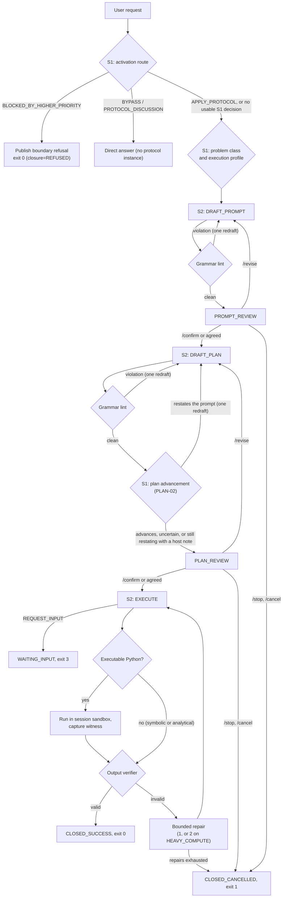

# PDL Taskmaster: Current Architecture

**Describes:** `pdl-taskmaster` 2.6.0rc1, the code in this repository.
**Scope:** what exists and runs today. Where the project is heading is in [`TARGET_ARCHITECTURE.md`](TARGET_ARCHITECTURE.md); nothing in this document describes planned behaviour.
**Normative authorities:** ADR-0001 through ADR-0022 ([`docs/adr/`](docs/adr/README.md)) and the guardrails in [`docs/guardrails/ANTI_OVERFITTING_AND_BENCHMARK_INTEGRITY.md`](docs/guardrails/ANTI_OVERFITTING_AND_BENCHMARK_INTEGRITY.md) (`GUARD-01` to `GUARD-05`). Where an ADR and the guardrails disagree, the guardrails win.

---

## 1. What PDL Taskmaster is

PDL Taskmaster is a protocol referee and runtime governor for model-driven tasks. It exists because *the component carrying out a task cannot be the only one deciding what the task means*. Before anything runs, the model restates the request as short Prompt Pseudocode and then as a Response Plan; each is shown for review, and execution starts only after both are confirmed.

Three rules shape the whole design:

1. **Route the sandbox conditions, not the model.** The harness never grades plan quality or reasoning style, uses no rubric and no model self-grading. System 1 routes physical and operational conditions (environment, budgets, review intent); the review gates align the task with the human.
2. **The referee invariant (`GUARD-01`, `GUARD-04`).** The harness is never a solver. It does not inject algorithmic advice, require algorithm keywords at review gates, or fabricate witnesses. A failed task is diagnostic signal; a gamed pass is an integrity breach.
3. **Session-scoped execution sandbox.** One `ExecutionSandbox` is built per session and reused for every program run in it.

### 1.1 Two planes

| Plane | Location | Knows the benchmark? | Responsibility |
|---|---|---|---|
| **Harness** | `src/pdl_taskmaster/` | **Never** | Protocol governance, input containment, sandboxed execution, schema verification |
| **Evaluation** | `run_catalogue.py`, `graders.py`, `prompts/`, `viewer/` | Yes | Drives headless catalogue runs, maps exit codes to verdicts, grades deliverables against `prompts/solutions/`, browses results |

The harness never reads `prompts/` and contains no prompt IDs, fixture names or problem-class vocabulary; `tests/test_harness_anti_overfitting.py` scans for them. Only the harness is shipped in the wheel.

---

## 2. Components

```
src/pdl_taskmaster/
├── host/            pdlt CLI (cli.py), REPL presentation (repl.py), PDLtHost turn API (app.py)
├── runtime/         SessionEngine orchestrator, workspace (in-memory VFS), context compiler,
│                    operation bridge (wire parsing), Pydantic wire models, Result IR, quarantine,
│                    normative store (contract resolution)
├── controller/      MechanicalController: the deterministic stage machine
├── providers/       System 2 workers (api, codex, recorded), System 1 client and recipes
├── verification/    output verifier, plan-soundness lint, error registry, ExecutionSandbox,
│                    confinement backends (Landlock, Seatbelt, AppContainer, container)
├── observation/     per-turn JSONL observation records
└── contracts/       bundled normative contracts and standards (hash-pinned)
```

| Layer | Owns | Does not own |
|---|---|---|
| `host/repl.py` | Terminal I/O, slash commands, paste handling, headless exit codes | Protocol state |
| `host/app.py` (`PDLtHost`) | Process and session lifetime; one call per user turn (`handle`) | Stage transitions |
| `runtime/session_engine.py` | Orchestrating operations, verification and sandbox runs | Terminal I/O (it never reads stdin or prints) |
| `controller/mechanical_controller.py` | Every stage transition | Model calls |
| `providers/` | One model call per request (`WorkerAdapter.call`) | Wire validity (the operation bridge decides) |

### 2.1 Model tiers

- **System 1** (`providers/sys1/`): a fast decision model (default `typesafe/jev-1.13` through OpenRouter's decisions endpoint) that returns calibrated label distributions, never text. Every recipe shares one confidence gate (`gating.py`): confidence $P \ge 0.85$, top-2 margin $\Delta p \ge 0.40$, normalized entropy $H(p) \le 0.35$.
- **System 2** (`providers/api_worker.py`): a generative model (default `openai/gpt-oss-120b` through OpenRouter) that drafts the Prompt and Plan and executes. With no `--api-providers`, the provider order is Baseten, then Crusoe, with fallbacks allowed (`OPENROUTER_PROVIDER` and `OPENROUTER_PROVIDER_ORDER` override it); measured provider behaviour is in [`PROVIDERS.md`](PROVIDERS.md). Reasoning effort defaults to high before execution and low at `EXECUTE` (ADR-0022). `--api-base-url` points it at another OpenAI-compatible endpoint; provider routing options (`--api-providers`) are OpenRouter's.
- **Other workers:** `codex` drives the Codex CLI as a System 2 worker; `recorded` replays fixtures for offline tests.

---

## 3. Protocol lifecycle

### 3.1 Stages

`MechanicalController` owns these stages; no worker output can move between them on its own.

| Stage | Meaning |
|---|---|
| `PROMPT_REQUIRED` | A request was accepted; Prompt Pseudocode must be drafted |
| `PROMPT_REVIEW` | Prompt Pseudocode is waiting for review |
| `PLAN_REQUIRED` | The prompt is confirmed; a Response Plan must be drafted |
| `PLAN_REVIEW` | The Response Plan is waiting for review |
| `EXECUTION_READY` | Both artifacts are confirmed; execution may start |
| `WAITING_INPUT` | Execution asked for required external input |
| `OUTCOME_UNCERTAIN` | A session was restored while an execution was in flight; its outcome is unknown |
| `CLOSED_SUCCESS` | A verified deliverable was published |
| `CLOSED_CANCELLED` | Cancelled, or verification failed after the repairs allowed |

Gates: no plan is drafted without a confirmed prompt, and nothing executes without a confirmed plan bound to that prompt. Empty input at a review gate re-prompts and is never taken as acceptance.

### 3.2 Decision flow



Review gates accept the fast-path commands `/confirm`, `/revise <feedback>`, `/stop` and `/cancel` without a model call. In fast mode (`--fast`, `/fast on`) the user confirms in advance: a review whose artifact carries no host finding is accepted without waiting (recorded as `STANDING_CONFIRMATION`); one with a finding stops as usual. Other review text goes to System 1 (`ConfirmationMatch`, then `ReviewFacets`) and, when System 1 is not confident, to System 2 interpretation; the harness never assumes an intent. A review command sent when no review is open gets a notice and is never treated as a new request.

### 3.3 Phases

| Phase | Mechanism | Outcomes |
|---|---|---|
| **0. Activation** | System 1 `activation_route` over environment **recipe state**: policy scope (`PDLT_POLICY_SCOPE`, default `technical`), network (`PDLT_SANDBOX_NETWORK`, default `false`), knowledge cutoff (`PDLT_KNOWLEDGE_CUTOFF`, default `2024-06`) and the sandbox's execution environment. No keyword, pattern or date matching. These settings never reach System 2. | `APPLY_PROTOCOL` → phase 1; gated `BLOCKED_BY_HIGHER_PRIORITY` → refusal, exit 0; `BYPASS` / `PROTOCOL_DISCUSSION` → direct answer |
| **1. Prompt review** | Grammar lint, then fast-path commands, then review intent | confirm → phase 2; revise → redraft; cancel → exit 1 |
| **2. Plan lint** | Deterministic lint (`plan_soundness.py`): PDL-05 no fielded prefixes, PDL-06 no code fences, PDL-08 no deferral or meta markers, PLAN-10 no placeholder steps. One redraft carrying the finding, through operator correction only (never `CARRIED_APPROACH_SOURCES`). No algorithm or execution keywords are required. | clean → plan advancement |
| **2b. Plan advancement (PLAN-02)** | System 1 `PlanAdvancementRecipe` compares the plan with the confirmed prompt on three task-neutral checks: the plan adds a solution action or deduction with its content, says how it handles the conditions that keep the task from being solved directly, and shows how the result will be obtained. A fourth question asks whether the prompt already states the method (then a plan has nothing to add). One confident failure gets one redraft whose operator correction names only the failed checks, never the decision text or a method; a plan that still fails is published unchanged (AUTH-05) with a `[host] PLAN-02` note, so fast mode never confirms it in advance. Uncertain or unavailable System 1 does not flag the plan. Every decision is a `PLAN_ADVANCEMENT` event. Live accuracy is measured by `run_plan_gate.py`. | advances → plan gate; restates → one redraft, then plan gate with a note |
| **3. Plan review** | Fast-path commands, then review intent | confirm → phase 4; revise approach → redraft plan; revise task → phase 1; cancel → exit 1 |
| **4. Execution** | System 2 `EXECUTE` | result → phase 5; `REQUEST_INPUT` → exit 3 |
| **5. Verification** | Pydantic output verifier with witness authority (§4). Result IR citation bookkeeping is recorded as `RESULT_IR_CITATION_FINDINGS` and never blocks. | pass → exit 0; contract failure → bounded repair → exit 1 |

**When System 1 is unavailable.** System 1 absent, unconfigured, failing or below its confidence gate yields no System 1 evidence: no refusal is published, the problem class defaults to `STANDARD_EXECUTION`, and the execution profile defaults to `STANDARD`. Boundary refusal therefore depends on a reachable System 1; the sandbox's own limits (no network, confinement) still apply whatever System 1 decides.

### 3.4 Headless exit codes (ADR-0019, as amended)

| Code | Meaning |
|---|---|
| `0` | `CLOSED_SUCCESS` (verified deliverable), or a published boundary refusal (`closure=REFUSED`) |
| `1` | `CLOSED_CANCELLED`: cancellation, verification failure after repair, or a fatal protocol error |
| `2` | Halted at a non-terminal stage, such as an unconfirmed review gate |
| `3` | `WAITING_INPUT`: paused for required external input |
| `4` | Harness or provider failure (`EXIT_HARNESS_ERROR`), for example a missing API key or a provider outage |
| `130` | Interrupted by the user (Ctrl+C) |

A run is headless when stdin is not a terminal or `--non-interactive` is given. `--exit-on-close` ends the process at the first closure; without it, further piped requests start new tasks in the same session.

---

## 4. Verification and witness authority

- **The sandbox-reproduced witness is authoritative.** When the deliverable contains executable code, the witness is what the sandbox prints: exactly one `WITNESS: <json>` line, or a whole stdout that parses as JSON. It replaces any model-asserted witness, and `WITNESS_OVERRIDDEN_BY_SANDBOX` is recorded when the two differ.
- **Model-asserted witnesses are provisional.** A witness no sandbox run reproduced is labelled `provisional` and never presented as verified.
- **Claims of computation must come from computation.** A negative witness reporting an exhausted search is accepted only when a host-run program printed it. Proof-based negative witnesses (an argument, no search telemetry) are first-class under `GUARD-03`.
- **An incomplete result must rest on an attempt.** Declaring requirements open without a witness is accepted only when a program actually ran in that attempt.
- **No scraping.** There is no label-regex scan of stdout or deliverable text.
- **Typed dispatch, no domain checkers shipped.** Checkers are selected only by a typed `witness.domain` field. This release registers no domain checkers, so every domain goes to `FallbackChecker`, whose verdicts are provisional: correctness rests on sandbox reproduction of the witness, not on a domain verifier.
- **Repairs carry facts, not hints.** Each repair carries the latest findings from a closed, task-neutral error registry (`verification/error_registry.py`) through operator correction.

---

## 5. Execution sandbox

### 5.1 Lifecycle

```
SessionEngine.__init__ : construct ExecutionSandbox once (limits, --sandbox mode)
probe()                : is the selected backend available here?
first run_code         : build the session root, owner record and policy; sweep stale roots
each run               : fresh empty work/run-NNNN-* directory, deleted afterwards
close()                : delete the root, release the backend
```

The session root is `<tempdir>/pdlt-sandboxes/<sid>/`, outside every tree the graders, runner and viewer read. A host killed before `close()` leaves a root whose owner process is dead; the next session's sweep removes it.

### 5.2 Containment

| Control | Mechanism |
|---|---|
| **Secret isolation** | The child environment is rebuilt from an allowlist (`PATH`, `TEMP`, `TMP`, `TMPDIR`; on Windows also `SYSTEMROOT`, `WINDIR`, `SYSTEMDRIVE`, `COMSPEC`, `PATHEXT`). API keys never reach model-authored code. |
| **OS-native confinement** (ADR-0021) | Write only the run directory; read it, the base interpreter's install and standard library, and loader files; execute only the base interpreter; no network; no new processes. Linux: Landlock. macOS: `sandbox-exec` with a deny-by-default profile. Windows: a per-session AppContainer inside a Job Object. `--sandbox container`: Docker or Podman, one container per session (no network, read-only root, no capabilities, process cap). |
| **Fail closed** | When the selected backend cannot apply, nothing runs (`sandbox_unavailable:<reason>`) and the REPL warns. `--sandbox audit-only` (`PDLT_SANDBOX=audit-only`) is the only opt-out and is announced loudly. The default mode is `auto`, which is native confinement; it does not fall back to the container. |
| **Audit hook** | Defense in depth: blocks native-code loading, file access outside the run directory, network calls, signals and process creation. |
| **Resource limits** | Windows: Job Object. POSIX: `RLIMIT_AS` and an `RLIMIT_CPU` backstop; macOS does not enforce `RLIMIT_AS`. A deterministic step counter enforces the routed step budget. |

This is not a VM boundary: side channels and kernel exploits are out of scope. The container mode is the stronger option. Details and self-checks: [`docs/SANDBOX.md`](docs/SANDBOX.md).

### 5.3 What a program can do

A program can compute and print. It cannot reach the network, start processes, or read or write anything outside its own run directory, and everything it writes is deleted when the run ends. The Result IR's `files` list names and grounds the deliverable's files, but **nothing is written into the user's project**: the deliverable is text the user applies.

---

## 6. System 1 recipes

All recipes live in `providers/sys1/recipes/`, emit discrete labels only, and contain no pattern matching (`test_routing_recipes_have_no_pattern_matching`).

| Recipe | Labels | Use |
|---|---|---|
| `ActivationRouteRecipe` | `APPLY_PROTOCOL`, `PROTOCOL_DISCUSSION`, `BYPASS`, `BLOCKED_BY_HIGHER_PRIORITY` | Phase 0 boundary routing over environment state |
| `ProblemClassRecipe` | `VERIFIED_EXECUTION`, `STANDARD_EXECUTION` | Whether the Result IR must carry a witness |
| `ConfirmationMatchRecipe`, `ReviewFacetsRecipe` | agrees / rejects / unclear; change dimensions | Review intent for free-text review messages |
| `ExecutionProfileRecipe` | `WITHIN_100K_STEPS` … `BEYOND_100M_STEPS` | Step-complexity routing to an execution budget |
| `FollowUpRecipe` | follow-up vs. new task | Routing messages after closure |

### 6.1 Execution budgets

| Prediction | Tier | Step budget | Memory | Wall clock | Repairs |
|---|---|---|---|---|---|
| `WITHIN_100K_STEPS` | `MINIMAL` | 100,000 | 256 MB | 30 s | 1 |
| `WITHIN_10M_STEPS` | `STANDARD` | 10,000,000 | 256 MB | 30 s | 1 |
| `WITHIN_100M_STEPS` | `HEAVY_COMPUTE` | 100,000,000 | 512 MB | 120 s | 2 |
| `BEYOND_100M_STEPS` | `HEAVY_COMPUTE` | 100,000,000 | 512 MB | 120 s | 2 |

The budget is the smallest one System 1 believes suffices with cumulative probability of at least 0.85; a diffuse prediction yields `STANDARD`. The step counter, not the prediction, decides. A `VERIFIED_EXECUTION` task with no registered domain verifier is refused before any System 2 call when System 1 puts more than 0.5 probability on `BEYOND_100M_STEPS` (`BUDGET_REFUSAL`). After plan confirmation the same recipe may raise the tier, never lower it. The budget the sandbox enforces is the one declared to System 2 in `AVAILABLE_EXECUTION_TOOLS`.

### 6.2 Cost controls

Every response is capped by `--max-output-tokens` (default 16,384, reasoning included); one model call has a 300 s deadline (`--api-call-deadline`); `--max-repairs N` overrides the tier's repairs. There is no session-level time or token budget. The catalogue runner kills a prompt's process tree at 600 s.

---

## 7. Input containment and context

- **Semantic bootstrap containment.** Raw user content is read only by `BOOTSTRAP_ANALYSIS`. Later operations (`DRAFT_PROMPT`, `DRAFT_PLAN`, `EXECUTE`) receive compiled projections, never raw user text. A redaction pass (`runtime/quarantine.py`) replaces canary, tripwire and override-directive tokens with `[REDACTED_IOC]`. Task entities are typed (ADR-0027: surface, kind, and what the request says about it, unknowns included) and are forwarded only when their surface is an exact substring of the sanitized request or summary.
- **Context compilation.** `context_compiler.py` builds one projection per operation from `EXECUTION_CONTRACT.json`, the applicable standard clauses and the stage inputs, and records SHA-256 digests of each clause and of the projection.
- **Contract resolution** (`normative_store.py`, ADR-0008), first match wins: `PDLT_STANDARDS_PATH`; `<candidate repo>/contracts/` (the candidate repo defaults to the current directory); `~/.pdlt/versions/<version>/contracts/`; the bundled copy in the package. An override replaces the whole contract set and is checked for structure only.
- **Workspace.** Sessions use an in-memory workspace (`MemoryWorkspaceRun`) persisted per turn under `turns/turn_NNN/`. The previous closed turn's request and deliverable are carried into the next turn's task inputs, and System 1 (`FollowUpRecipe`) routes whether a new message continues it; rejected drafts are never carried.

---

## 8. Observability

- The REPL prints stage and per-call telemetry in dev mode (`--dev`), writes a transcript, and points to a `worker-progress.log` updated during model calls.
- `--observation-dir` writes one JSONL record per turn: model calls with usage (input, output, reasoning and cached tokens), latency, controller state before and after, and the turn's new workspace events. Records are written when a turn completes; there is no live event stream.
- **Call lifecycle** (`providers/call_trace.py`). Every model call, System 1 included, records each HTTP attempt's progress: `prepared → connecting → request_sent → acknowledged → response_started → response_complete`, with the HTTP status, response bytes, outcome (completed, interrupted, http_error, transport_error, timeout, unreadable), whether the interruption was local (Ctrl+C) or remote, and whether it was retried. `request_sent` and `connecting` come from Python's own `http.client` audit events, `acknowledged` (the API receipt) from the status line. Each finished or interrupted call is appended to the session's `call-trace.jsonl`; dev mode prints a line for any call that retried or did not complete.
- **Interruptions.** On Ctrl+C the REPL reports where the call was (not sent; sent but not acknowledged; acknowledged, no response; response partly received; between calls) and the engine records `TURN_INTERRUPTED` (the in-flight operation, whether its output was recorded, the in-memory and persisted stage). A turn that never bound a protocol instance is marked `INTERRUPTED`, which is not a closed status, so chaining and follow-ups never mistake it for the previous turn; a bound turn keeps its persisted stage and the next input re-drives it. A review artifact committed to the controller but not yet published is republished from the controller state. State files (controller state, workspace files, the session pointer) are written replace-on-write (`fileio.py`), so an interruption never leaves a partial file.
- The evaluation-plane viewer (`python -m viewer`) is read-only and binds `127.0.0.1` only.

---

## 9. Guardrails

| Guardrail | Rule in this codebase |
|---|---|
| `GUARD-01` | `CARRIED_APPROACH_SOURCES` comes only from user-originated sources; lint and retry feedback travel only by operator correction. |
| `GUARD-02` | No harness file targets benchmark tokens, prompt phrases or problem-class vocabulary. |
| `GUARD-03` | No regex scraping of deliverables; proofs and analytical deductions are first-class deliverables. |
| `GUARD-04` | Gates never require algorithm or execution keywords, and worker guidance never mandates code. |
| `GUARD-05` | Contract files match `CONTRACT_MANIFEST.json` hashes, and the harness is scanned against tokens derived from the catalogue manifest (`tests/test_harness_anti_overfitting.py`). |

---

## 10. What this release does not do

These are known limits of 2.6.0rc1. Each is captured as future work in [`TARGET_ARCHITECTURE.md`](TARGET_ARCHITECTURE.md) and ADR-0023 to ADR-0026; none of them is implemented here. The full release audit, including smaller follow-ups, is [`docs/audits/RELEASE_AUDIT_2.6.0rc1.md`](docs/audits/RELEASE_AUDIT_2.6.0rc1.md).

- **No structured client interface.** Callers drive the REPL through text on stdin and read text and exit codes; there is no machine-readable result, live event stream or delegated review-gate API (ADR-0023).
- **One cost setting.** Reasoning depth, output length, verification depth and model choice are set separately by flags but not by a profile, and there is no session-level time or token budget (ADR-0024).
- **No effects on the user's project.** Programs cannot create or edit project files, and there is no tool broker (ADR-0025).
- **No extension model.** Operation prompts are part of the code, contract overrides replace the whole set without a compatibility check, and there are no workflow packs (ADR-0026).
- **System 1 is remote.** The default System 1 is OpenRouter's decisions endpoint; without it, boundary refusal does not run (§3.3).
- **Groq cannot serve `EXECUTE` or `EMIT_RESULT_IR`.** It rejects their schemas, so the worker routes those calls to the other configured providers and tells OpenRouter to ignore Groq for them; `--api-providers Groq` alone stops at `EXECUTE` with a clear message ([`PROVIDERS.md`](PROVIDERS.md) §3). The exclusion is a fixed table, not yet the capability routing of ADR-0024.
- **`PDLT_SANDBOX_NETWORK` is routing state only.** Setting it to `true` changes what System 1 is told; the sandbox never grants network access.
- **Headless review gates are confirmed by piping `/confirm`.** The catalogue measures autonomous drafting under the lint gates, not human review (`gate_policy` in `RUN_META.json`).
- **The category 10 multi-turn scripts are not run.** Category 10 prompts run single-turn; their scripts are kept in the manifest's `multi_turn_script` field.
- **Live runs need credentials.** `OPENROUTER_API_KEY` is required for live sessions and catalogue runs; the offline test suite needs none.
