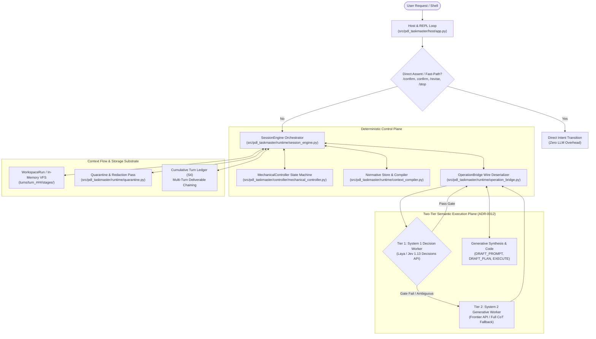
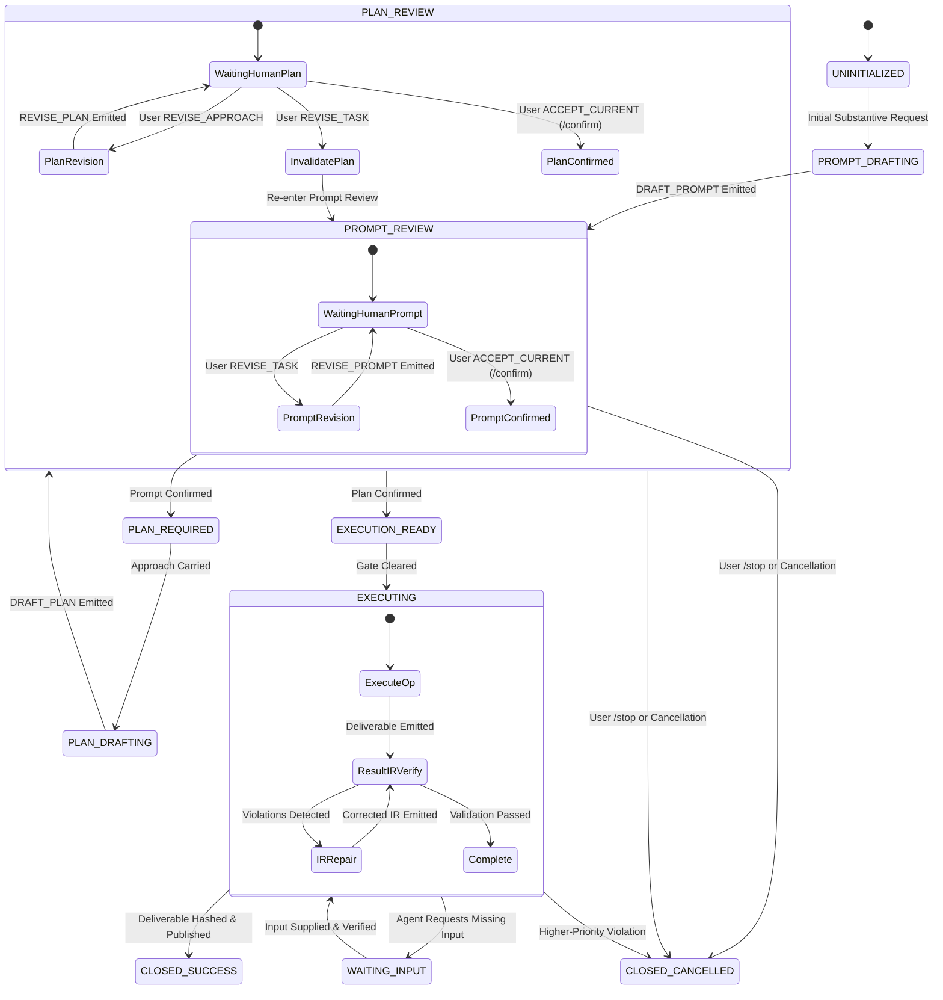
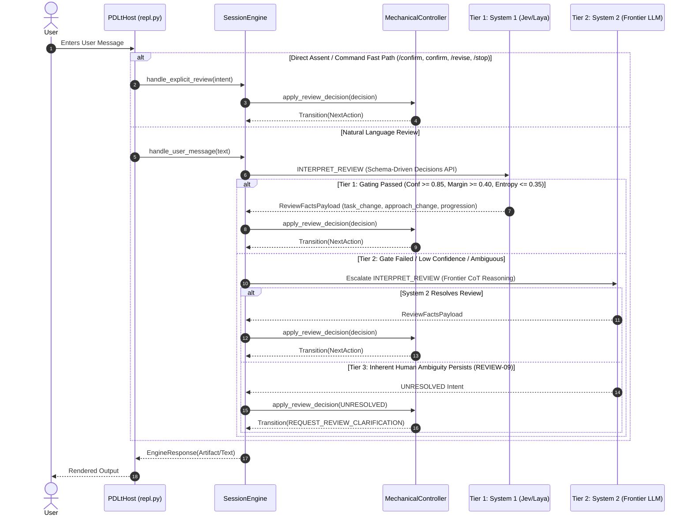
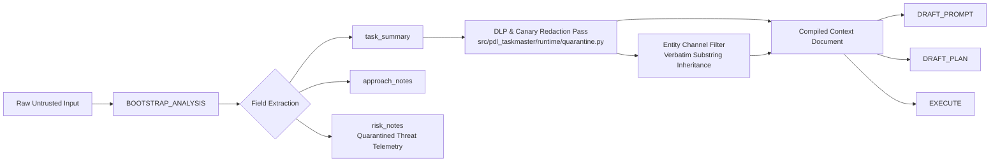
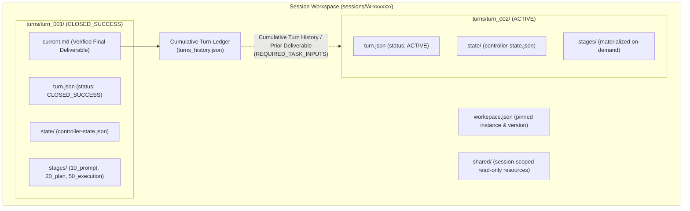

# PDL Taskmaster — Systems Architecture & Execution Blueprint

**System Lineage**: `v2.0.0` $\to$ `v2.3.0` $\to$ `v2.4.0` (Active Development)  
**Chartered Consensus ID**: `49ac3d41` (via `waymark-engine`)  
**Base Lineage Ratifications**: ADR-0001 through ADR-0012; TRD-0001 through TRD-0003  

---

## 1. Executive Summary & Core Philosophy

**PDL Taskmaster (PDL-Standard-REPL-Harness)** is a controller-gated, deterministic alignment harness designed to solve the foundational dilemma of autonomous agent systems: *the component carrying out the task cannot be the sole entity deciding what the task means*.

The harness enforces a dual mandate:
1. **Fidelity (Evidence I)**: A task must be executed strictly as the requester intended, not as the model prefers to interpret it—ensuring accurate actor attribution (`SEM-05`), explicit ambiguity surfacing, and strict preservation of technical contracts (`TASK-01`).
2. **Containment (Evidence II)**: Content arriving *inside* a task (quoted text, documents, embedded user instructions) must remain passive data. Through architectural semantic bootstrap containment (`BOOTSTRAP_ANALYSIS`), raw untrusted input is physically quarantined from compilation operations, while downstream deliverables and entities are screened through native DLP sanitization (`SEM-06`).

Both mandates are enforced by **one unified mechanism**: compiling immutable normative standards into per-operation context projections, physically isolating untrusted input behind a semantic bootstrap read, and mechanically gating state transitions behind human-verified pseudocode artifacts.



---

## 2. Subsystem Topology & Directory Blueprint

```
PDL-Standard-REPL-Harness/
├── contracts/                        # Normative authorities & execution bindings
│   ├── standards/                    # Immutable standard specifications (*.md)
│   ├── AUTHORITY_MAP.json            # Normative authority hierarchy
│   ├── EXECUTION_CONTRACT.json       # Per-operation input/output symbols & clauses
│   └── VERIFICATION_CONTRACT.json    # Automated stage verification requirements
├── docs/                             # Architecture specifications & decision records
│   ├── adr/                          # Architectural Decision Records (ADR-0001..0012)
│   ├── architecture/                 # Whitepapers & framing specifications
│   ├── governance/                   # Roadmap, experiment logs, and release plans
│   └── trd/                          # Technical Requirement Documents (TRD-0001..0003)
├── src/pdl_taskmaster/               # Packaged Python distribution root
│   ├── contracts/                    # Bundled normative contracts (Tier 4 store)
│   ├── controller/                   # Deterministic state machine & transition rules
│   │   └── mechanical_controller.py  # Stage, Intent, Transition, MechanicalController
│   ├── eval/                         # Adversarial and fidelity qualification suites
│   │   ├── build_adversarial_battery.py # F6 27-case breadth-first battery generator
│   │   ├── fidelity_scan.py          # Track P requirement recall and adherence scorer
│   │   ├── leak_scan.py              # Strict full-text deliverable & metadata scanner
│   │   └── run_qualified_batch.py    # Paired A/B execution harness with Wilson escalation
│   ├── host/                         # User-facing terminal REPL, pdlt CLI, and host loop
│   │   ├── app.py                    # PDLtHost process and turn lifecycle manager
│   │   ├── cli.py                    # pdlt umbrella command line entry point
│   │   └── repl.py                   # Terminal loop, fast paths, and argument parsing
│   ├── observation/                  # Structured telemetry sinks and event schemas
│   ├── providers/                    # Execution worker backends (API, Codex, Stubs)
│   │   ├── api_worker.py             # OpenAI-compatible API client with tiering & caching
│   │   ├── fixtures.py               # Fixture builder for deterministic test replay
│   │   └── live_stub.py              # Offline deterministic test worker
│   ├── runtime/                      # Core protocol orchestrator and data plane
│   │   ├── context_compiler.py       # Per-operation prompt projection compiler
│   │   ├── normative_store.py        # 4-tier precedence standards resolver
│   │   ├── operation_bridge.py       # Wire serializer, deserializer, and schema parser
│   │   ├── quarantine.py             # D29 generalized canary and IOC redaction pass
│   │   ├── result_ir.py              # TRD-0003 Result IR decomposition and verifier
│   │   ├── session_engine.py         # SessionEngine 5-stage orchestrator
│   │   ├── wire_payloads.py          # Pydantic v2 wire models (ADR-0010)
│   │   └── workspace.py              # Context-flow workspace and turn hierarchy (S3/S4)
│   └── tracking/                     # Optional MLflow tracking sink
├── tests/                            # Offline test suite (87 passed, 1 skipped)
│   └── fixtures/                     # Self-contained recorded cases & battery manifests
└── runs/                             # External evaluation manifests and run ledgers
```

---

## 3. Protocol State Machine & Lifecycle (MechanicalController)

Protocol state transitions are strictly deterministic and owned by `MechanicalController`. No semantic worker or model output can bypass stage gates.



### Stage Transition Rules
1. **Gate 1 Invariant (`AUTH-01`, `PROTO-02`)**: The engine cannot transition to `PLAN_DRAFTING` without an immutable, confirmed `Prompt` artifact in the active workspace.
2. **Gate 2 Invariant (`AUTH-02`, `PROTO-02`)**: The engine cannot transition to `EXECUTION_READY` without an immutable, confirmed `Plan` artifact bound to the confirmed `Prompt`'s cryptographic hash.
3. **Negative Constraint by Omission (`ADR-0007`, `PLAN-10`, `EXEC-05`)**: Negative constraints and exclusions must be operationalized as structural omission rather than defensive runtime wrappers.
4. **Silence-Deferral Defense (`D3`, `REVIEW-14`)**: Submitting whitespace or empty input during review stages re-prompts for confirmation and never defaults to acceptance.

---

## 4. Subsystem Deep-Dives

### 4.1 Host & REPL Loop Subsystem (`src/pdl_taskmaster/host/`)
* **Role**: Owns the OS process lifetime, terminal I/O loop, configuration resolution, and telemetry sink initialization.
* **Fast-Path Engine (`U1`, `src/pdl_taskmaster/host/repl.py`)**: Intercepts direct assent (`/confirm`, bare `confirm`, `yes`, `proceed`) as well as explicit commands (`/revise <feedback>`, `/stop`) directly in the REPL and engine, applying review intents straight to `SessionEngine.handle_explicit_review()`. This bypasses expensive 15-second LLM classification round-trips for unambiguous user actions.
* **Non-Interactive Mode**: Fully headless support (`--non-interactive`) with portable POSIX key resolution for SSH relays and automated qualification drivers.



---

### 4.2 Quarantine & Redaction Data Plane (`src/pdl_taskmaster/runtime/quarantine.py`)
* **Role**: Enforces the semantic-bootstrap containment boundary established in Protocol v2 (ADR-0003, TRD-0002, Decision D20).
* **Primary Control — Architectural Isolation**: Raw untrusted user content is read exclusively by `BOOTSTRAP_ANALYSIS`. Compile operations (`DRAFT_PROMPT`, `DRAFT_PLAN`, `EXECUTE`) **never** receive raw user text; they operate strictly on compiled context projections.
* **Secondary Control — DLP & Canary Redaction Pass (`D29`)**: Acts as a defense-in-depth data loss prevention backstop:
  - Automatically sanitizes synthetic canary prefixes (`TRIPWIRE_*`, `CANARY_*`).
  - Detects and replaces prefix-free canonical UUIDs (`[a-f0-9]{8}-[a-f0-9]{4}-...`).
  - Detects and redacts high-entropy hex sequences ($\ge 32$ hexadecimal characters).
  - Sanitizes all Indicators of Compromise (IOCs) into `[REDACTED_IOC]`.
* **Entity Inheritance (`R2`)**: Forwarded task entities must be exact substrings of the *sanitized* summary. Hostile tokens stripped at the compile tier cannot be re-injected.



---

### 4.3 Context Compilation & Projections (`src/pdl_taskmaster/runtime/context_compiler.py`)
* **Role**: Compiles immutable, content-addressed prompt projections per operation.
* **Mechanism**:
  1. Inspects `contracts/EXECUTION_CONTRACT.json` to identify required input symbols and normative standard clauses for the target operation.
  2. Resolves standard text from the version-pinned Normative Store (`~/.pdlt/versions/v2/` per ADR-0008).
  3. Formats clauses, higher-priority constraints, and stage values into a structured projection document.
  4. Computes `projection_sha256` for audit tracking and offline fixture replay.
  5. Serializes prompt output with support for `--render-compact` (23% token reduction) and `--cache-order-render` (prefix caching optimization).

---

### 4.4 Result IR Decomposition & Verification (`src/pdl_taskmaster/runtime/result_ir.py`)
* **Role**: Enforces structured result-decomposition per ADR-0009 and TRD-0003 (`RS-01` through `RS-10`).
* **Mechanism**:
  - `derive_requirements`: Extracts numbered requirements from confirmed prompt pseudocode.
  - `render_execution_brief`: Drafts execution entities, delivery markers (`### filename.py`), and wire format declarations before code generation.
  - `validate_result_ir`: Deterministically reconciles declared requirements against evidence paths (`execution://body`, workspace outputs) and validates wire-format arithmetic.
  - `EMIT_RESULT_IR`: Dedicated repair operation that re-emits only the corrected Result IR on validation failure without forcing full code re-emission.

---

### 4.5 Storage Architecture & Turn Hierarchy (`src/pdl_taskmaster/runtime/workspace.py`)
* **Role**: Manages multi-turn workspace hierarchies and deliverable chaining (ADR-0008 S3/S4).
* **Two-Level Directory Invariant**:
  - **Level 1 (Substantive Task Epoch)**: `turns/turn_###/` encapsulates an entire protocol cycle from user intent to `CLOSED_SUCCESS`.
  - **Level 2 (Invocations)**: `stages/<stage_id>/input/####-<operation>/` and `output/####-<operation>/` isolate intermediate model requests and responses.
* **Cross-Turn Deliverable Chaining (S4)**: When a session advances to `turn_###+1`, confirmed deliverables from all prior `CLOSED_SUCCESS` turns are maintained in a **Cumulative Turn Ledger** within the workspace: `[(turn_001, confirmed_prompt, deliverable_body), (turn_002, confirmed_prompt, deliverable_body), ...]`.
  - For sequential continuation, the immediate prior deliverable ($T-1$) is injected into `REQUIRED_TASK_INPUTS`.
  - For retrospective or multi-problem tasks (e.g. "show work on the last two problems"), the full cumulative ledger is projected, preventing cross-turn amnesia and placeholder generation.
  - Intermediate scratchpad drafts, rejected plans, and unconfirmed dialogue are structurally discarded, preserving the semantic containment boundary.



---

## 5. Architectural Modernization Strategy (ADR-0010 through ADR-0012)

Recent architectural reviews identified critical bottlenecks in the `v2.3.0` baseline, now codified into three active Architecture Decision Records:

### ADR-0010: Pydantic Schema Enforcement
* **Target Subsystem**: `src/pdl_taskmaster/runtime/operation_bridge.py`
* **Defect Remedied**: Manual JSON parsing via `_object()`, ad-hoc key checks (`_keys()`), and coarse string-based `WireError`s.
* **Modernization**:
  - Strongly typed Pydantic v2 `BaseModel`s for all operation outputs (`ActivationDecisionPayload`, `BootstrapAnalysisPayload`, `PromptDraftPayload`, `ReviewFactsPayload`, `ExecutionDraftPayload`, `ExecutionOutcomePayload`).
  - Provider schemas for `--api-structured-output` generated directly from `model_json_schema()`.
  - Precision operator corrections generated from `ValidationError.errors()` injected into the retry-once loop in `SessionEngine._call`.

### ADR-0011: Software-Defined In-Memory VFS & Ephemeral Sandboxing
* **Target Subsystem**: `src/pdl_taskmaster/runtime/workspace.py` and `src/pdl_taskmaster/controller/mechanical_controller.py`
* **Defect Remedied**: High I/O latency and file bloat on Windows NTFS caused by 60–100 synchronous `os.fsync()` calls and directory creations per turn.
* **Modernization**:
  - **Shipped Substrate (v2.4.0)**: In-memory Virtual Filesystem (`MemoryWorkspaceRun`) and cached state store (`MemoryAtomicJsonStore`) executing stage handoffs in RAM buffers with fast unjournaled disk writes, dropping workspace I/O from **~3,000ms to $<1\text{ms}$**. Single-artifact turn persistence on terminal status (`flush_turn_archive`).
  - **Exploratory Execution Isolation (Phase 10 Roadmap)**: Ephemeral Copy-on-Write (CoW) MicroVM Sandboxing (Firecracker / E2B) for isolated runtime tool execution during `EXECUTE`, strictly gated behind MCP.

### ADR-0012: System 1 Decision Models via RLCD over Laya/Jev
* **Target Subsystem**: Track L realignment (Phases 6–7)
* **Defect Remedied**: Autoregressive distillation into 3B–7B Qwen models suffers from JSON decode errors, markdown fence corruption, 15s token latency, and contextual amnesia.
* **Modernization**:
  - **Non-Generative Classification Head**: Replace generative LLM review interpretation with non-autoregressive "System 1" decision models (**Laya** open-weights ModernBERT / **Jev** API) operating in a single forward pass ($<20\text{ms}$, zero syntax errors).
  - **Sovereign Tripartite Fallback Ladder (ADR-0012 §4.3)**:
    1. **Tier 1 (System 1 Fast-Path, <300ms)**: Invokes native Decisions API (POST `/api/alpha/decisions`). Passes when calibrated confidence $P_{\text{cal}} \ge 0.85$, top-2 margin $\Delta p \ge 0.40$, and normalized entropy $H(p) \le 0.35$.
    2. **Tier 2 (System 2 Frontier Escalation, ~3–8s)**: If System 1 fails any gating check or is ambiguous, the worker MUST NOT emit `UNRESOLVED`. It dynamically escalates to System 2 (Frontier LLM with CoT) to interpret human intent.
    3. **Tier 3 (Mechanical Human Card, `REVIEW-09`)**: If ambiguity persists even after System 2 evaluation, the engine rewrites intent to `UNRESOLVED`, halting execution and prompting the human to clarify.
  - **Schema-Driven Dynamic Questions**: System 1 question definitions must derive dynamically from normative wire models (`wire_payloads.py` / `EXECUTION_CONTRACT.json`), fully supporting `revises_approach` alongside `revises_task` and `progression_requested`. Plan feedback is never hard-coded out of existence.
  - **Alignment via RLCD (arXiv:2307.12950)**: Train decision heads by pairing positive prompt traces (from Track P) with negative adversarial traces (from F6) scored by the deterministic `MechanicalController` oracle.
  - **Two-Tier Hybrid Split**: System 1 for sub-20ms governance classifications; System 2 (Frontier reasoning) for creative drafting and deliverable code generation.

---

## 6. Normative Standards & Verification Matrix

The repository maps executable contracts to immutable specifications in `contracts/standards/`:

| Standard File | Clause Prefix | Normative Scope & Enforcement Mechanism |
| :--- | :--- | :--- |
| `ARTIFACT_STANDARD.md` | `ART-*` | Cryptographic hashing, immutability, and state publishing rules for prompt/plan pairs. |
| `AUTHORITY_STANDARD.md` | `AUTH-*` | Hierarchical authority rules; controller owns transition boundaries; human confirmation is sovereign. |
| `CONFORMANCE_STANDARD.md` | `CONFORM-*`| Deterministic state machine compliance and verifiable transition invariants. |
| `CONTEXT_STANDARD.md` | `CONTEXT-*` | Positive inclusion (`CONTEXT-01`) and rejected context exclusion (`CONTEXT-04`). |
| `EXECUTION_STANDARD.md` | `EXEC-*` | Safe deliverable emission (`EXEC-04`), negative constraint omission (`EXEC-05`), and tool execution. |
| `PDL_STANDARD.md` | `PDL-*` | Prompt Pseudocode formatting, IR syntax, and clause representation standards. |
| `PROTOCOL_STANDARD.md` | `PROTO-*` | 5-stage lifecycle rules, confirmation gates, and recovery transitions. |
| `RESPONSE_PLAN_STANDARD.md`| `PLAN-*` | Approach formulation, dependency sequencing, and negative constraint omission (`PLAN-10`). |
| `RESULT_STANDARD.md` | `RS-*` | TRD-0003 structured Result IR decomposition, evidence citations, and arithmetic checks. |
| `REVIEW_STANDARD.md` | `REVIEW-*` | Multi-dimensional review classification, progression gating, and silence non-acceptance (`REVIEW-14`). |
| `SEMANTIC_INPUT_STANDARD.md`| `SEM-*` | Untrusted input quarantine (`SEM-02`), actor attribution (`SEM-05`), and token redaction (`SEM-06`). |
| `TASK_SEMANTICS_STANDARD.md`| `TASK-*` | Operative specification preservation (`TASK-01`) and technical contract immutability. |

---

## 7. Operational & Verification Commands

```bash
# Run complete test suite (unit, integration, and baseline invariants)
pytest

# Execute F6 adversarial battery (qualification sweep)
python -m pdl_taskmaster.eval.run_qualified_batch --trials 3 --out-dir runs/adversarial/

# Run paired A/B comparison report (Evidence II format)
python -m pdl_taskmaster.eval.compare_eval_runs --summary-a runs/adversarial/summary.json

# Launch interactive terminal REPL with API worker
pdlt --worker api --model z-ai/glm-4.7

# Query Waymark architectural consensus memory
waymark ask "Full repository architecture, state machine, and call flow in PDL Taskmaster" --plain
```
