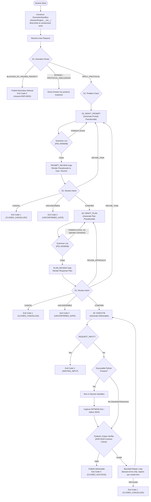

# Target Architecture: PDL Taskmaster v2.7.0 — Lean Build
## Tripartite, Condition-Routed Protocol Governor

**Status**: Approved Target — Lean Build (PDLt-Test)  
**Evolution Lineage**: `v2.6.0` (Active Baseline) $\to$ `v2.7.0` (Target Architecture)  
**Lean Build**: The harness package `src/pdl_taskmaster/` lives in PDLt-Test beside the frozen catalogue. Excluded upstream folders: `eval/`, `tracking/`, `tools/`, `verify/`.  
**Normative Authorities**: ADR-0001 through ADR-0020 (ported to `docs/adr/`); `docs/guardrails/ANTI_OVERFITTING_AND_BENCHMARK_INTEGRITY.md` (`GUARD-01` through `GUARD-05`)  
**Core Axiom**: *"Route the sandbox conditions, not the model."*

---

## 1. Executive Vision & Foundational Axioms

The PDL Taskmaster Protocol (`pdl-taskmaster`) is an objective protocol referee and runtime governor. It addresses the foundational dilemma of agentic systems: *the component carrying out the task cannot be the sole entity deciding what the task means*.

### The Three Foundational Axioms

1. **Axiom 1: Route the Sandbox Conditions, Not the Model.**
   - The harness never qualitatively evaluates plan "completeness", "elegance" or "reasoning style". It uses no heuristic rubrics and no LLM self-grading.
   - The deterministic pseudocode loop (`PROMPT_REVIEW` $\to$ `PLAN_REVIEW`) already aligns semantic task requirements with the human or evaluator.
   - System 1's role is strictly physical and operational: routing environment bounds, network permissions, knowledge cutoffs and review intent.

2. **Axiom 2: The Referee Invariant (`GUARD-01`, `GUARD-04`).**
   - The harness is an impartial referee, NEVER an AI task solver.
   - It never injects algorithmic advice, coaches the model with domain hints, requires algorithmic keywords in review gates, or fabricates synthetic witnesses.
   - **A failed benchmark is acceptable and diagnostic of genuine model capability boundaries. A gamed benchmark is a critical integrity breach.**

3. **Axiom 3: Session-Scoped Execution Sandbox.**
   - The host sandbox is not built just in time during the execution turn.
   - `ExecutionSandbox` is constructed once in `SessionEngine.__init__`, bound to the session lifecycle, and reused by `_execute` for every run in that session.
   - Latency is measured in dev telemetry, not asserted.

### 1.4 Two Planes: Harness vs. Evaluation

| Plane | Location | Knows the benchmark? | Responsibility |
|---|---|---|---|
| **Harness plane** | `src/pdl_taskmaster/` | **Never** | Protocol governance, containment, sandboxed execution, schema verification |
| **Evaluation plane** | `run_catalogue.py`, `graders.py` | Yes | Drives headless runs, maps exit codes to verdicts, and grades deliverables against `prompts/solutions/` |

The harness plane never reads `prompts/`. It contains no prompt IDs, fixture names or problem-class vocabulary, and `GUARD-05` enforces this mechanically. All ground-truth knowledge lives in the evaluation plane, so a correct harness cannot pass by recognising a benchmark item.

---

## 2. The Tripartite Architecture

The target architecture enforces a strict tripartite separation of concerns:

```
┌───────────────────────────────────────────────────────────────────────────┐
│                               USER REQUEST                                │
└─────────────────────────────────────┬─────────────────────────────────────┘
                                      │
                                      ▼
┌───────────────────────────────────────────────────────────────────────────┐
│ 1. ROUTER (System 1 Fast Classifier — Jev via Sys1Client)                 │
│    • Responsibility: Discrete, calibrated state machine labels            │
│    • Recipes:                                                             │
│      - ActivationRoute: APPLY_PROTOCOL | PROTOCOL_DISCUSSION | BYPASS |   │
│                         BLOCKED_BY_HIGHER_PRIORITY                        │
│      - ProblemClass:    VERIFIED_EXECUTION | STANDARD_EXECUTION           │
│      - Review Intent:   ConfirmationMatch → ReviewFacets                  │
│      - ExecutionProfile: predicted step complexity -> step budget         │
│    • Invariant: Emits discrete labels only; code strictly owns state      │
│      transitions; zero qualitative plan grading or prompt rewriting       │
└──────────────────┬─────────────────────────────────────┬──────────────────┘
                   │                                     │ (Boundary Refusal)
                   │ (Valid Path)                        ▼
                   │                           ┌───────────────────────────┐
                   │                           │ PUBLISHED REFUSAL         │
                   │                           │ Exit 0 (closure=REFUSED)  │
                   │                           └───────────────────────────┘
                   ▼
┌───────────────────────────────────────────────────────────────────────────┐
│ 2. SOLVER (System 2 Frontier LLM - e.g. gpt-oss-120b @ low reasoning)    │
│    • Responsibility: Pure reasoning under neutral protocol contracts      │
│    • Operations:                                                          │
│      - DRAFT_PROMPT: Compiles natural input into Prompt Pseudocode        │
│      - DRAFT_PLAN: Generates Response Plan Pseudocode (PDL-01..08)        │
│      - EXECUTE: Emits deliverable code or analytical symbolic deductions   │
│    • Invariant: Prompted purely with standard protocol specifications;    │
│      never receives algorithmic hints, carried crutches, or answer tokens │
└──────────────────┬────────────────────────────────────────────────────────┘
                   │
                   ▼
┌───────────────────────────────────────────────────────────────────────────┐
│ 3. VERIFIER (Deterministic Python & Session-Scoped Host Sandbox)          │
│    • Responsibility: Formal contract evaluation & host execution          │
│    • Operations:                                                          │
│      - Grammar Lint: Enforces PDL-05/06/08 on prompt & plan, no keywords  │
│      - Host Sandbox: Executes code with CPU, memory & containment limits  │
│      - Witness Capture: `WITNESS: <json>` line or whole-stdout JSON only  │
│      - Pydantic SSOT (ADR-0018): Schema validation with alias coercion    │
│      - First-Class Reasoning (GUARD-03): Accepts symbolic proofs as valid │
│    • Invariant: ZERO regex deliverable scraping; zero model self-grading  │
└───────────────────────────────────────────────────────────────────────────┘
```

### 2.1 Witness Authority

- **Sandbox-reproduced witness is authoritative.** When the deliverable contains executable code, the witness is what the sandbox prints: exactly one `WITNESS: <json>` line, or an entire stdout that parses as JSON. A validated sandbox witness **replaces** any model-asserted witness in the Result IR, and a `WITNESS_OVERRIDDEN_BY_SANDBOX` event is recorded whenever the two differ.
- **An incomplete result must rest on an attempt.** A Result IR that declares requirements open, records the defect and carries no witness needs no witness, but only when a program actually ran in that attempt. With no program, the open requirement was never attempted: that is a verification error, not an honest limit.
- **Claims of computation must come from computation.** A negative witness that reports an exhausted search (`basis: search`, or `search_exhausted` / `nodes_explored` under any basis) is accepted only when a program run by the host printed it. Otherwise it is a verification error, since no search happened. Proof-based negative witnesses (an argument, no search telemetry) remain first-class under GUARD-03.
- **Model-asserted witnesses are provisional.** A witness that no sandbox run reproduced is labelled `provisional` in telemetry and in the deliverable card. It is never presented as verified.
- **No scraping.** There is no label-regex scan of stdout, no embedded-object search, and no bypass keyed on words in the deliverable body or prompt text.
- **Typed dispatch.** Domain checkers are selected only by a typed `witness.domain` field. An undeclared or unregistered domain goes to `FallbackChecker`, whose verdicts are always provisional. The verifier never infers the domain from problem text.

---

## 3. Discrete Decision Tree Across the Interaction Lifecycle

Instead of monolithic reasoning or heuristic plan grading, the protocol executes a deterministic decision tree, with a discrete System 1 evaluation at each transition boundary:



### Lifecycle Stage Specification

| Phase | Input | Evaluation Mechanism | Permitted Outputs / Transitions |
|---|---|---|---|
| **Phase 0: Activation** | Raw user request | System 1 `activation_route` over environment **recipe state** (policy scope, offline sandbox, knowledge cutoff). No keyword, pattern, or date matching. Runs first on every new request, including explicit `$confirm-with-pseudocode` invocations; a gated decision overrides the invocation, an ungated one leaves it standing | `APPLY_PROTOCOL` $\to$ Phase 1<br>`BLOCKED_BY_HIGHER_PRIORITY` $\to$ refusal published, Exit `0` (`closure=REFUSED`)<br>`BYPASS` / `PROTOCOL_DISCUSSION` $\to$ direct answer |
| **Phase 1: Prompt Review** | Drafted prompt + user feedback or assent | Grammar lint, then fast-path commands (`/confirm`, `/revise`, `/stop`), then System 1 review intent | `CONFIRM` $\to$ Phase 2<br>`REVISE_TASK` $\to$ re-draft Prompt<br>`CANCEL` $\to$ Exit `1`<br>`UNCONFIRMED` $\to$ Exit `2` |
| **Phase 2: Plan Lint** | Response Plan | Deterministic grammar lint (`plan_soundness.py`): PDL-05 no fielded prefixes, PDL-06 no code fences, PDL-08 no deferral/meta markers. **No algorithm or execution keywords.** | Clean $\to$ Plan Gate<br>Violation $\to$ one re-draft, feedback via **operator correction** (never via `CARRIED_APPROACH_SOURCES`) |
| **Phase 3: Plan Review** | User feedback or assent | Fast-path commands, then System 1 review intent | `CONFIRM` $\to$ Phase 4<br>`REVISE_APPROACH` $\to$ re-draft Plan<br>`REVISE_TASK` $\to$ Phase 1<br>`CANCEL` $\to$ Exit `1` |
| **Phase 4: Execution** | Confirmed Prompt & Plan | System 2 `EXECUTE` | `RESULT` $\to$ Phase 5<br>`REQUEST_INPUT` $\to$ Exit `3` |
| **Phase 5: Verification** | Deliverable + Sandbox Stdout | Deterministic Pydantic schemas (`output_verifier.py`), with witness authority per §2.1. Result IR citation bookkeeping (verbatim quotes, section markers, one reconciliation per requirement) is recorded as `RESULT_IR_CITATION_FINDINGS`, never blocking: it describes the deliverable, it is not its correctness | Pass $\to$ Exit `0` (`CLOSED_SUCCESS`)<br>Contract failure $\to$ bounded repair (1 repair; 2 on `HEAVY_COMPUTE`) $\to$ Exit `1` |

### Headless Exit Codes (ADR-0019, amended)

| Code | Stage | Meaning |
|---|---|---|
| `0` | `CLOSED_SUCCESS` | A verified deliverable was published, **or** a boundary refusal was published (`closure=REFUSED`). A refusal is a correct, complete answer, which is how the frozen manifest scores it. |
| `1` | `CLOSED_CANCELLED` | Cancellation, verification failure after repair, or a fatal error. |
| `2` | `UNCONFIRMED_GATE` | Halted at a review gate. |
| `3` | `WAITING_INPUT` | Clean pause awaiting required external input. |

---

## 4. Session-Scoped Sandbox Architecture

### The Defect of Just-In-Time Sandboxing
In prior versions (`v2.5.0`–`v2.6.0`), a new `ExecutionSandbox` was constructed inline at each witness-capture site in `_execute`, and the process environment was inherited wholesale. That created two problems:
- Sandbox policy lived in several places.
- Host secrets reached model-authored code.

### Target Session Lifecycle

```
Session Start (SessionEngine.__init__)
  │
  ├── 1. Construct ExecutionSandbox once (timeouts, memory ceiling, network policy)
  ├── 2. Snapshot environment policy (PDLT_SANDBOX_NETWORK, etc.)
  └── 3. Reuse the same sandbox instance for every run in the session
```

1. **Session boot hook.** `SessionEngine` instantiates `ExecutionSandbox` in `__init__`. Every `_execute` witness-capture site uses `self.sandbox`.
2. **Ephemeral runs.** Each run executes in a fresh temporary scratchpad under OS-native limits.
3. **Agentic tool readiness.** A single session-owned sandbox is the insertion point for future host-gated tools such as bash, file edits and compilation.

### 4.1 Sandbox Containment

| Control | Mechanism |
|---|---|
| **Secret isolation** | The environment is rebuilt from an allowlist: `PATH`, `SYSTEMROOT`, `TEMP`, `TMP`, `PYTHONIOENCODING`, `PYTHONUNBUFFERED`. API keys never reach model-authored code. |
| **Network & process denial** | A `sys.addaudithook` prelude raises `PermissionError` on `socket.connect`, `socket.bind`, `socket.getaddrinfo`, `subprocess.Popen`, `os.system`, `os.exec*`, `os.spawn*` and `os.posix_spawn`. It is skipped only when `allow_network=True`. |
| **Resource limits** | Windows Job Objects (memory, kill-on-close) and POSIX `setrlimit(RLIMIT_AS)` with process-group kill on timeout. The step budget, memory limit and wall-clock safety limit are the task's routed budget (§5, `ExecutionProfileRecipe`). |
| **Interpreter isolation** | `python -I -s`, run in an ephemeral scratchpad cwd. |

**Honest boundary statement:** these controls are defense in depth, not a VM or container boundary. Audit hooks run in-process, and hostile native code can defeat them. Stronger isolation (microVM, per ADR-0011) remains roadmap.

---

## 5. System 1 Recipe Specification (Eliminating Qualitative Noise)

### The Category Error of Generic Recipes
Generic recipes from `jev-recipes` are strictly prohibited in this protocol. Examples are `plan-completeness`, designed for grading student essays, and `choose-action`, designed for game checkers. As the `jev-recipes` specification states:
> *"The rubric grades whether the plan covers the requirements the task states... It does not judge whether the planned steps would work, how long they would take... The recipe does not tell you which requirement is missing."*

Applying qualitative essay rubrics to formal pseudocode causes non-deterministic gate stalls. It forces models to overfit to stylistic quirks, and it directly violates Goodhart's Law.

### Protocol Recipe SSOT

The harness implements these discrete, calibrated System 1 recipes (`src/pdl_taskmaster/providers/sys1/recipes/`). All of them share the tripartite confidence gate (`gating.py`): confidence $P \ge 0.85$, top-2 margin $\Delta p \ge 0.40$, and normalized entropy $H(p) \le 0.35$.

#### 1. `ActivationRouteRecipe` (Physical Boundary Enforcement)
- **Input:** raw user task string plus the environment state.
- **Labels:** `APPLY_PROTOCOL | PROTOCOL_DISCUSSION | BYPASS | BLOCKED_BY_HIGHER_PRIORITY`.
- **Recipe state, not prompt text:** the environment settings are System 1 recipe **state**: `policy_scope` (`PDLT_POLICY_SCOPE`), `sandbox_network` (`PDLT_SANDBOX_NETWORK`) and `knowledge_cutoff` (`PDLT_KNOWLEDGE_CUTOFF`). They are the first thing Jev routes. The recipe criterion for `BLOCKED_BY_HIGHER_PRIORITY` refers to those three fields, and the S1 model decides. There is no keyword, pattern or year matching anywhere, and **the environment settings never reach System 2**.
- **Phase 0 always runs:** the engine invokes this route before any System 2 call, for explicit invocations too (`SessionEngine._s1_boundary_refusal`). A gated `BLOCKED_BY_HIGHER_PRIORITY` publishes the refusal (`closure=REFUSED`, exit 0). System 1 absent, uncertain or failing yields no refusal, never a guess.
- **Execution environment is recipe state too:** the state carries `execution_environment` (from `ExecutionSandbox.decision_state`, e.g. standard library only). A request that depends on a package, SDK or service the environment does not provide is routed like a post-cutoff request: its existence and behaviour cannot be known or verified here.
- **Not a refusal:** mathematical impossibility, unsatisfiability and contradictory requirements are **deliverables** under GUARD-03, not boundary refusals. The budget gate below refuses on the environment (no budget and no verifier can certify the result here), never on the mathematics.
- **Invariant:** hardcoding benchmark entity names (e.g. `frostbitedb`) or prompt-specific tokens is banned.

#### 2. `ProblemClassRecipe` (Verification Mode Routing)
- **Input:** the substantive request.
- **Labels:** `VERIFIED_EXECUTION | STANDARD_EXECUTION`.
- **Function:** selects whether the Result IR must carry a witness. The criteria are generic: the existence of a discrete structure that satisfies stated constraints, or an exact solution with a checkable witness.
- **Invariant:** S1 only, with **no keyword regex**. If S1 is unavailable or below the gate, the label defaults to `STANDARD_EXECUTION`.

#### 3. Review Intent (`ConfirmationMatchRecipe` → `ReviewFacetsRecipe`)
- **Input:** user review feedback at `PROMPT_REVIEW` or `PLAN_REVIEW`.
- **Flow:** `ConfirmationMatch` (`agrees | rejects | unclear`) runs first. When that is unclear, `ReviewFacets` returns multi-label change dimensions. The fast-path commands `/confirm`, `/revise` and `/stop` bypass S1 entirely.
- **Fallback:** below threshold, the input falls back to System 2 interpretation. The harness never assumes an intent.

#### 4. `ExecutionProfileRecipe` (Step-Complexity Routing)
- **Input (recipe state):** the substantive request **and the sandbox it would run in**: the execution environment (interpreter, standard library only, network access), the step definition, and the budget each label grants, all built from the same source the sandbox enforces (`ExecutionSandbox.decision_state`). System 1 routes sandbox conditions, so it must see them.
- **Labels (predicted step complexity, ordered):** `WITHIN_100K_STEPS | WITHIN_10M_STEPS | WITHIN_100M_STEPS | BEYOND_100M_STEPS`. A step is one executed Python bytecode instruction of the program's own code (including code run through `exec` and functions passed to library calls); standard-library and built-in internals are not counted, so importing a module is not the task's complexity.
- **Function:** the prediction selects a budget from one fixed table (`verification/sandbox.py` `EXECUTION_BUDGETS`):

  | Prediction | Tier | Step budget | Memory | Wall-clock safety | Repairs |
  |---|---|---|---|---|---|
  | `WITHIN_100K_STEPS` | `MINIMAL` | 100,000 | 256 MB | 30 s | 1 |
  | `WITHIN_10M_STEPS` | `STANDARD` | 10,000,000 | 256 MB | 30 s | 1 |
  | `WITHIN_100M_STEPS` | `HEAVY_COMPUTE` | 100,000,000 | 512 MB | 120 s | 2 |
  | `BEYOND_100M_STEPS` | `HEAVY_COMPUTE` | 100,000,000 | 512 MB | 120 s | 2 |

- **Repairs scale with the routed tier, not the prompt:** harder tiers get one extra verification repair. Every repair carries only the latest factual host findings (operator correction), never hints. Each result records its model calls (`model_calls`, counted from its events, wire retries included), and the scoreboard totals calls, EXECUTE calls and repairs, so a harness condition with more repairs is compared with a control at equal cost.
- **Diffuse means uncertain:** a prediction is usable only when 85% of the mass lies within two adjacent magnitudes (a ~100x range). A flatter distribution is System 1 being uncertain and yields `STANDARD`, never the largest budget.
- **Weighted, not argmax:** the labels are ordered, so the granted budget is the smallest one System 1 believes suffices with cumulative probability of at least 0.85. Probability split between neighbouring magnitudes resolves to the upper one rather than failing a confidence gate. The budget is deliberately as tight as the prediction justifies: an oversized budget would let work pass that the task's complexity does not warrant, a false positive by construction. The full distribution is recorded in `EXECUTION_PROFILE_ROUTED`.
- **No zero tier:** the smallest budget (100,000 steps) still lets a deliverable check itself by execution; a zero budget would forbid code (method guidance, GUARD-04) and disable sandbox witness reproduction.
- **Prediction routes, the counter decides:** the sandbox counts steps deterministically (an opcode trace installed before model code runs). On the first step past the budget the process exits (`step_budget_exceeded`); the program cannot catch it, and changing the tracer is denied by an audit hook. One-line loops, comprehensions, `exec`'d code, callbacks the program passes to library calls, and threads started through `threading` all count. Standard-library and built-in internals are not counted in steps; the wall-clock limit bounds them. Tracing slows pure-Python code by about 27x, which affects only the wall-clock, never the step budget.
- **One source of truth:** the budget the sandbox enforces is the budget declared to System 2 in `AVAILABLE_EXECUTION_TOOLS`, so impossibility is a checkable fact relative to a known budget, as a control model knows its own compute. `EXECUTION_PROFILE_ROUTED` records the prediction and budget; `SANDBOX_RUN` records whether the budget was exceeded; graders re-run code under the same budget.
- **Budget gate (policy refusal):** a task whose result must be certified (`VERIFIED_EXECUTION`) is refused before any System 2 call when no domain verifier is registered for it and System 1 puts more than 0.5 probability on `BEYOND_100M_STEPS` ("more likely than not" beyond the largest budget). Neither a sandbox reproduction nor a checker could certify its result here. The refusal states the budget and the missing verifier (`closure=REFUSED`, exit 0; event `BUDGET_REFUSAL`). The threshold is the a-priori majority point, not a value fitted to any prompt.
- **Otherwise `BEYOND_100M_STEPS` is recorded, not refused:** the task gets the largest budget and the step counter decides. Comparing the recorded predictions with measured outcomes is how the prediction earns trust before it could ever gate a refusal; a prediction is not proof that no efficient method exists.
- **Plan-time prediction (one-way):** after the plan is confirmed and before the first `EXECUTE`, the same recipe predicts the cost of the confirmed procedure (state: the confirmed Prompt as the request, the confirmed Plan as `procedure`, the same environment). A usable prediction may *raise* the tier routed from the request, never lower it; the raised budget is what the sandbox enforces and what `AVAILABLE_EXECUTION_TOOLS` declares. Nothing else about the prediction reaches System 2: no redraft, no finding, no mention (GUARD-01). `PLAN_PROFILE_ROUTED` records both tiers and whether the budget was raised; `SANDBOX_RUN` records `steps_used` (reported by the counter at exit and stripped from the program's stderr), so each prediction can be compared with the steps actually used. The plan-time prediction does not gate a refusal until that comparison shows it tracks measured cost.
- **Resources only:** System 1 never decides the answer, the method, or whether code is written (there is no "symbolic only" label: declaring it would be method guidance, GUARD-04). System 1 absent, failing, or returning no usable distribution over the known labels yields `STANDARD`.

---

## 6. Verification Integrity & The Referee Invariant

### The 5 Normative Guardrails

The target architecture treats the five guardrails in `docs/guardrails/ANTI_OVERFITTING_AND_BENCHMARK_INTEGRITY.md` as non-negotiable invariants:

| Guardrail | Invariant | Concrete Architectural Rule |
|---|---|---|
| **`GUARD-01`** | **No Synthetic Approaches** | `session_engine._draft_plan` sends `CARRIED_APPROACH_SOURCES` only from user-originated sources. Lint and retry feedback travel only through the operator-correction channel. |
| **`GUARD-02`** | **General Boundary Routing** | No harness file hardcodes benchmark tokens (`frostbitedb`), prompt-specific phrases, or problem-class vocabulary in classifiers or verifiers. |
| **`GUARD-03`** | **Pydantic SSOT & First-Class Reasoning** | Verifiers never regex-scrape deliverable text. Mathematical proofs and analytical deductions are first-class deliverables without Python code. |
| **`GUARD-04`** | **Zero Algorithmic Coaching** | Plan gates never require algorithmic or execution keywords (`MRV`, `DLX`, `backtracking`, `python`, `script`), and worker guidance never mandates code. |
| **`GUARD-05`** | **Automated Integrity Gate** | Contract files match `CONTRACT_MANIFEST.json` SHA-256 hashes with LF normalization. `tests/test_harness_anti_overfitting.py` also scans the harness plane against tokens **derived from `prompts/CATALOGUE_MANIFEST.jsonl`**: every prompt-file stem, plus a fixed benchmark and algorithm vocabulary. |

### Diagnostic Failure vs. Benchmark Gaming
A core philosophy of the target architecture is **embracing diagnostic failure**:
- Suppose a model (e.g. `gpt-oss-120b` at `reasoning: low`) fails a combinatorial prompt because of an algorithmic timeout or state-space explosion. **That failure is valid empirical signal.**
- Injecting algorithmic coaching, or tuning review gates to accept incomplete outputs, compromises the harness's scientific validity.
- The harness succeeds when it accurately measures model boundaries, and fails when it helps the model cheat.
- **Passing the benchmark** means two things: every prompt reaches its manifest `expected_stage`, and **zero false positives** occur on the prompts graded against ground truth in the evaluation plane.

---

## 7. Migration & Implementation Roadmap

```mermaid
timeline
    title PDL Taskmaster v2.7.0 Lean Build Roadmap
    section Phase 0 : Integrity & Containment
      Port runtime into PDLt-Test (lean folder selection) : Lean Build
      Remove coaching, benchmark tokens, witness scraping : Lean Build
      Sandbox env allowlist & audit-hook containment : Lean Build
      Extend GUARD-05 scan with manifest-derived tokens : Lean Build
    section Phase 1 : Session Sandbox
      Construct ExecutionSandbox in SessionEngine.__init__ : Lean Build
      Session cleanup hooks : Target v2.7.0-P1
    section Phase 2 : Condition Routing
      Knowledge cutoff via S1 state (no regex) : Lean Build
      Deploy ExecutionProfileRecipe in sys1 : Lean Build
    section Phase 3 : First-Class Deductions
      Witness authority & provisional labelling : Lean Build
      Formalize symbolic deliverables in output_verifier : Target v2.7.0-P3
    section Phase 4 : Benchmark Validation
      Ground-truth graders in evaluation plane : Lean Build
      Run 105-prompt catalogue (single attempt, manifest order) : Lean Build
      Publish un-gamed scoreboard with false-positive count : Lean Build
```

### Immediate Action Items
1. **Integrity fixes.** Remove every GUARD violation identified in the v2.6.0 audit: coaching strings, keyword classifiers, witness scraping, and inherited sandbox environment.
2. **Session sandbox.** Construct `ExecutionSandbox` in `SessionEngine.__init__` and reuse it in `_execute`.
3. **Automated continuous gate.** Run `pytest tests/test_harness_anti_overfitting.py -v` before every catalogue run and on every commit.

---

## 8. Known Limitations

- **Evaluator notes live in the manifest.** Tester notes (13-02 to 13-07, 14-07) and the category 10 multi-turn scripts are manifest fields (`tester_note`, `multi_turn_script`), not prompt text. The runner sends only the prompt file to the harness and copies these fields into `result.json` for the human spot check. `tests/test_catalogue_integrity.py` fails if tester-facing text reappears in a prompt.
- **Multi-turn category.** The category 10 prompts are run single-turn, as the manifest defines them. Their scripts are kept in `multi_turn_script` for a future multi-turn runner.
- **Headless gate policy.** In headless runs the evaluator confirms review gates by piping `/confirm`. This is the existing protocol, and it is recorded in `RUN_META.json` as `gate_policy`. The benchmark therefore measures autonomous drafting under lint gates, not human review.
- **Live runs need credentials.** Catalogue execution requires `OPENROUTER_API_KEY`. Offline tests cover the protocol, containment and graders.
