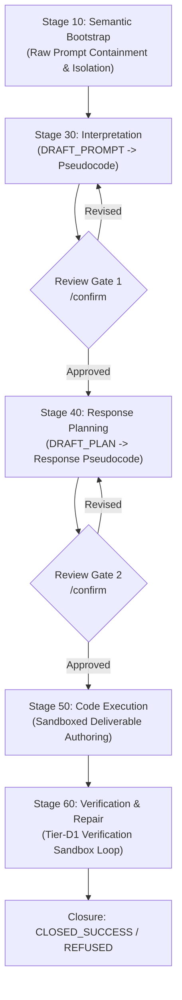

# Architecture & Execution Routing

PDLt structures agent execution through deterministic multi-stage pipelines and formal execution contracts.

---

## Execution Pipeline Stages

### 1. Stage 10: Semantic Bootstrap Containment
Raw prompt content from the user or benchmark is ingested strictly into an isolated bootstrap structure. Untrusted text cannot invoke shell tools or trigger uninspected actions.

### 2. Stage 30: Interpretation (`DRAFT_PROMPT`)
The model drafts high-level pseudocode capturing its interpretation of the user's intent. In confirmed routes, this is presented to the user for explicit gating.

### 3. Stage 40: Planning (`DRAFT_PLAN`)
The model drafts high-level procedural pseudocode outlining the concrete algorithms, data structures, and edge cases to implement.

### 4. Stage 50: Execution (`EXECUTE`)
The model writes executable code under OS sandbox confinement. In DRAFT-EXECUTE mode, a typed execution brief (method, data structures, step estimate checked against the budget, invariants, self-checks, exact task strings) is drafted first for tasks that are or need an algorithm or a calculation, and passed to EXECUTE as its own input.

### 5. Stage 60: Verification & Repair (`Tier-D1`)
The authored deliverable is executed in the isolated sandbox. If errors or assertion failures occur, structured diagnostic feedback is fed back to the model for up to $N$ repairs.

---

## The Execution Routes

PDLt has four harness routes (Arms 1-4) and an unharnessed control, to balance auditability against execution latency. Calls and seconds per prompt are measured in the [benchmark sweep](benchmarks.md) (112 prompts, `openai/gpt-oss-120b`, reasoning `low`):

| Route | CLI Flags | Pipeline Structure | Calls / prompt | Seconds / prompt | Use Case |
| :--- | :--- | :--- | :---: | :---: | :--- |
| **Control: Direct Model** | `--route control` | Raw single-turn completion (unharnessed) | 1.0 | 2.5 | Baseline for benchmark comparison & pure sandboxed grading of any model's completions |
| **Arm 1: Unconfirmed** | `--route unconfirmed` | Direct execution without review gates | 2.0 | 12.7 | Lean autonomous default; on the benchmark's efficient frontier |
| **Arm 2: Confirmed** | `--route confirmed` | Gated prompt pseudocode + gated plan pseudocode | 4.3 | 17.9 | Human-reviewed prompt and plan; full audit trail |
| **Arm 3: Confirmed + DRAFT-EXECUTE** | `--route confirmed --draft-execute` | Arm 2 + execution brief (only for tasks that need verified execution) | 4.4 | 19.8 | Human-reviewed, with an execution brief |
| **Arm 4: Unconfirmed + DRAFT-EXECUTE** | `--route unconfirmed --draft-execute` | Arm 1 + execution brief (only for tasks that need verified execution) | 2.1 | 13.2 | Same cost class as Arm 1 |

**Tier D1 is on by default in every harness arm** (`--no-tier-d1` turns it off): the model's own failing self-tests are fed back as repair findings. It does not apply to the control route. On the benchmark the confirmed routes cost about twice the calls of the unconfirmed ones without a measured accuracy gain; what they add is the reviewable audit trail. The execution brief ran on only 9 of the 112 prompts, so the benchmark cannot say whether it helps. See [Benchmark & Four-Arm Parity](benchmarks.md) for the comparison and its caveats.

### Direct Control Baseline (`--route control`)
Developers can use PDLt as an unharnessed evaluation harness for third-party models without protocol machinery:
- **Direct Single-Turn Execution**: Evaluates raw model completions without prompt interpretation, plan reviews, or repair loops.
- **Confinement & Sandbox Parity**: Deliverable evaluation and hidden-test grading run under the identical OS-native `ExecutionSandbox` (Landlock, Seatbelt, AppContainer, Container) with OS memory bounding, ensuring adversarial prompt responses cannot escape confinement.
- **Universal Flag Parity**: Supports non-protocol flags (`--model`, `--reasoning`, `--timeout`, `--max-output-tokens`, `--providers`, `--sandbox`, `--repeat`, `--theme`, `--user-color`, `--assistant-color`, `--dry-run`).

---

## Output Contracts & Schema Governance

All stage boundaries communicate through strictly validated JSON schemas. Every stage transition is verified against output contracts (e.g. `tests/test_output_contracts.py`), preventing schema drifts or malformed serialization from destabilizing the pipeline.
