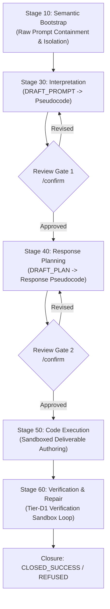

# Architecture & Execution Routing

PDLt structures agent execution through deterministic multi-stage pipelines and formal execution contracts.

---

## Execution Pipeline Stages

### 1. Stage 10: Semantic Bootstrap Containment
Raw prompt content from the user or benchmark is ingested strictly into an isolated bootstrap structure. Untrusted text cannot invoke shell tools or trigger uninspected actions.

### 2. Stage 30: Interpretation (`DRAFT_PROMPT`)
The model drafts high-level pseudocode capturing its interpretation of the user's intent. In confirmed routes, this is presented to the user for explicit gating.

### 3. Stage 40: Planning (`DRAFT_PLAN`)
The model drafts high-level procedural pseudocode outlining the concrete algorithms, data structures, and edge cases to implement.

### 4. Stage 50: Execution (`EXECUTE`)
The model writes executable code under OS sandbox confinement. In DRAFT-EXECUTE mode, a lean execution brief is generated to guide code synthesis.

### 5. Stage 60: Verification & Repair (`Tier-D1`)
The authored deliverable is executed in the isolated sandbox. If errors or assertion failures occur, structured diagnostic feedback is fed back to the model for up to $N$ repairs.

---

## The Four Execution Arms

PDLt supports four distinct execution topologies to balance auditability against execution latency:

| Arm | CLI Flags | Pipeline Structure | Model Calls | Use Case |
| :--- | :--- | :--- | :--- | :--- |
| **Control: Direct Model** | `--route control` | Raw single-turn completion (unharnessed) | 1 call | Baseline benchmark comparison & pure sandboxed harness |
| **Arm 1: Unconfirmed** | `--route unconfirmed` | Direct execution without intermediate gates | 2 calls | Ultrafast baseline |
| **Arm 2: Confirmed** | `--route confirmed` | Gated prompt pseudocode + gated plan pseudocode | 4–6 calls | Full human auditability |
| **Arm 3: Confirmed + DRAFT-EXECUTE** | `--route confirmed --draft-execute --tier-d1` | Multi-stage gates + lean brief + Tier-D1 sandbox loop | 4–5 calls | High-assurance enterprise workflows |
| **Arm 4: Unconfirmed + DRAFT-EXECUTE** | `--route unconfirmed --draft-execute --tier-d1` | Direct route + execution brief + Tier-D1 sandbox loop | 3 calls | **Pareto optimal autonomous agent mode** |

### Direct Control Baseline (`--route control`)
Developers can use PDLt as an unharnessed evaluation harness for third-party models without protocol machinery:
- **Direct Single-Turn Execution**: Evaluates raw model completions without prompt interpretation, plan reviews, or repair loops.
- **Confinement & Sandbox Parity**: Deliverable evaluation and hidden-test grading run under the identical OS-native `ExecutionSandbox` (Landlock, Seatbelt, AppContainer, Container) with OS memory bounding, ensuring adversarial prompt responses cannot escape confinement.
- **Universal Flag Parity**: Supports non-protocol flags (`--model`, `--reasoning`, `--timeout`, `--max-output-tokens`, `--providers`, `--sandbox`, `--repeat`, `--theme`, `--user-color`, `--assistant-color`, `--dry-run`).

---

## Output Contracts & Schema Governance

All stage boundaries communicate through strictly validated JSON schemas. Every stage transition is verified against output contracts (e.g. `tests/test_output_contracts.py`), preventing schema drifts or malformed serialization from destabilizing the pipeline.
