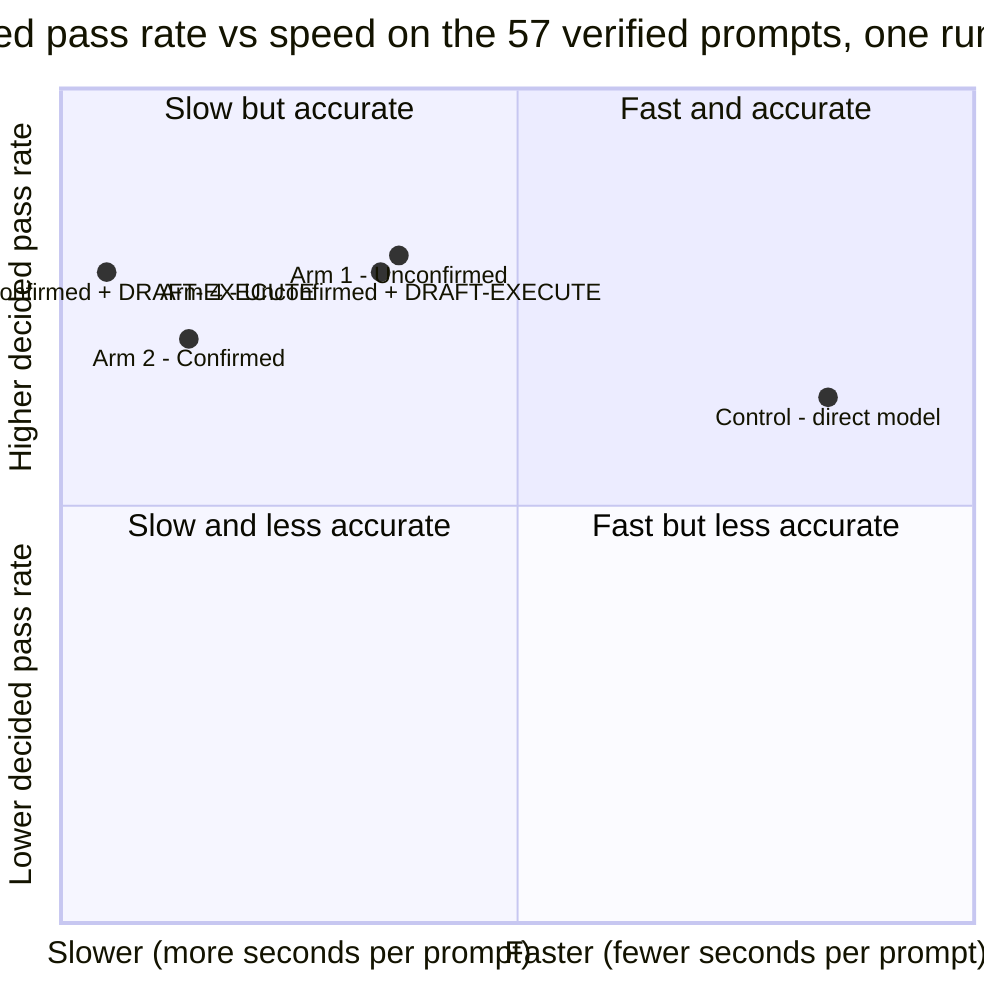

# Benchmark & Four-Arm Parity Analysis

One sweep of the full 112-prompt catalogue on `openai/gpt-oss-120b`: the four PDLt arms and an unharnessed **Control** (the raw model, graded by the same graders under the same sandbox). Every figure in the tables is generated from the runs' own artifacts by `experiments/five_arm_report.py`; only the commentary is written by hand.

## Result in brief

- **Every harness arm scored above the raw model on the 57 machine-graded prompts, but the gap is not established.** Decided pass rate: Arm 1 80.4%, Arms 3 and 4 78.4%, Arm 2 70.0%, Control 62.7%. With one run per prompt no pairwise gap passes p < 0.05 (closest: Arm 1 vs Control, p = 0.078).
- **The harness routes separate on cost, not on accuracy.** The unconfirmed routes (Arms 1 and 4) make about 2 calls and take about 13 s per prompt; the confirmed routes (Arms 2 and 3) make about 4.4 calls and take 18-20 s. Pooling each route's two arms, unconfirmed passed 79.4% of decided prompts and confirmed 74.3%, a gap inside the repeat noise below. Confirmation buys a human-readable audit trail, which these graders do not score.
- **DRAFT-EXECUTE barely ran.** It runs only when a task needs verified execution: 9 of 112 prompts (all seven combinatorial-search prompts, 13-01 and 16-07). On the other 103, Arms 3 and 4 are second runs of Arms 2 and 1, and they disagree with those arms on 12 to 17 of 48 verified prompts. That is the repeat noise of this setup, and the sweep cannot say whether the brief helps.
- **Read the control column as 62.7% to at most 74.5%.** Six of its 19 fails are answers the graders could not read; see the caveats.

## What changed since the previous version of this page

The earlier page compared Arms 3 and 4 only, at a 90 s timeout, and scored 55 prompts with a rubric tier judged by `openai/gpt-oss-120b` itself: one judge, and inline rubrics for 28 of the prompts that were never frozen. This page replaces it: all five routes, one 300 s timeout, and a headline that rests only on the prompts a machine grader can check. The rubric tier is withdrawn (see the caveats). The earlier conclusion that Arm 4 passes more verified prompts than Arm 3 (44 vs 39 of 57) is not reproduced: here both pass 40.

## The five routes

| Route | CLI | Pipeline | Tier D1 | Model calls per prompt (measured) |
| :--- | :--- | :--- | :---: | :---: |
| **Control: direct model** | `--route control` | One raw completion of the prompt. No pseudocode, plan, gate or repair. | n/a | 1.00 |
| **Arm 1: Unconfirmed** | `--route unconfirmed` | Bootstrap analysis, then execution, with System 1 routing. No review gates. | on | 2.03 |
| **Arm 2: Confirmed** | `--route confirmed` | Bootstrap, gated prompt pseudocode, gated plan pseudocode, execution. | on | 4.33 |
| **Arm 3: Confirmed + DRAFT-EXECUTE** | `--route confirmed --draft-execute` | Arm 2 plus an execution brief before the first execution. | on | 4.40 |
| **Arm 4: Unconfirmed + DRAFT-EXECUTE** | `--route unconfirmed --draft-execute` | Arm 1 plus an execution brief. | on | 2.12 |

Tier D1 feeds the model's own failing self-tests back to it as repair findings; it is the shipped default and `--no-tier-d1` turns it off. It is on in all four arms, so the comparison isolates the route and DRAFT-EXECUTE. The brief ran on only 9 of the 112 prompts, so each DRAFT-EXECUTE arm differs from its plain counterpart on at most 9 of them.

## How the sweep was run

- **Model:** `openai/gpt-oss-120b` through OpenRouter, provider routing unpinned, reasoning effort `low` on every operation, output cap 16,384 tokens.
- **Prompts:** all 112, one run each, per-prompt timeout 300 s (the process tree is killed on expiry and the prompt counts as a failure). No arm timed out.
- **Order:** Control, Arm 1, Arm 4, Arm 2, Arm 3, each as its own `run_catalogue.py` invocation, one after another, from a clean tree at commit `7a882f10`, on 2026-10-08.
- **Sandbox:** the OS-native sandbox (AppContainer on this Windows host) confines model-authored programs and the graders alike.
- **System 1:** the Arms 1-4 routing and review gates call the `typesafe/jev-1.13` classifier; Control does not.
- **A pass** is the expected terminal stage and a grader PASS. Ungraded prompts and prompts awaiting a human check are never passes. *Decided* excludes the pending ones.
- **Verified set:** 57 prompts have a machine grader: categories 01, 02, 05, 13, 14 and 16 in full, and 03 (4 of 7), 04 (6 of 7) and 06 (5 of 7). A few of those grades ask for a human spot check and show as pending. The other 55 prompts are reported at stage level only.

## Results

### Provenance

| Route | Run | Commit | Tier D1 | DRAFT-EXECUTE |
| :--- | :--- | :--- | :---: | :---: |
| Control: direct model | `run-20261008-060545-control` | `7a882f10` | n/a | no |
| Arm 1: Unconfirmed | `run-20261008-061233-unconfirmed-tier-d1` | `7a882f10` | on | no |
| Arm 2: Confirmed | `run-20261008-070631-confirmed-tier-d1` | `7a882f10` | on | no |
| Arm 3: Confirmed + DRAFT-EXECUTE | `run-20261008-074156-confirmed-draft-execute-tier-d1` | `7a882f10` | on | yes |
| Arm 4: Unconfirmed + DRAFT-EXECUTE | `run-20261008-063956-unconfirmed-draft-execute-tier-d1` | `7a882f10` | on | yes |

### Verified ground truth: decided pass rate (57 prompts)

| Route | Pass | Fail | Pending | Decided pass rate (95% CI) | Pass of all 57 | Of the fails: false positives / missed stage |
| :--- | :---: | :---: | :---: | :---: | :---: | :---: |
| Control: direct model | 32 | 19 | 6 | **62.7%** (49.0%-74.7%) | 56.1% | 19 / 0 |
| Arm 1: Unconfirmed | 41 | 10 | 6 | **80.4%** (67.5%-89.0%) | 71.9% | 7 / 3 |
| Arm 2: Confirmed | 35 | 15 | 7 | **70.0%** (56.2%-80.9%) | 61.4% | 12 / 3 |
| Arm 3: Confirmed + DRAFT-EXECUTE | 40 | 11 | 6 | **78.4%** (65.4%-87.5%) | 70.2% | 9 / 2 |
| Arm 4: Unconfirmed + DRAFT-EXECUTE | 40 | 11 | 6 | **78.4%** (65.4%-87.5%) | 70.2% | 7 / 4 |

### Cost and latency (all 112 prompts)

| Route | Model calls | Calls / prompt | Mean s / prompt | Median | p90 | Total time | Timeouts | Harness faults | Key spend |
| :--- | :---: | :---: | :---: | :---: | :---: | :---: | :---: | :---: | :---: |
| Control: direct model | 112 | 1.00 | 2.5 | 2.3 | 3.5 | 5 min | 0 | 0 | $0.09 |
| Arm 1: Unconfirmed | 227 | 2.03 | 12.7 | 11.9 | 20.2 | 24 min | 0 | 0 | $0.29 |
| Arm 2: Confirmed | 485 | 4.33 | 17.9 | 17.0 | 26.0 | 33 min | 0 | 0 | $0.34 |
| Arm 3: Confirmed + DRAFT-EXECUTE | 493 | 4.40 | 19.8 | 19.6 | 28.1 | 37 min | 0 | 0 | $0.32 |
| Arm 4: Unconfirmed + DRAFT-EXECUTE | 237 | 2.12 | 13.2 | 12.6 | 19.1 | 25 min | 0 | 0 | $0.19 |

### Full catalogue outcomes (112 prompts)

| Route | Pass | Fail | Pending | Ungraded | Held | Reached expected stage |
| :--- | :---: | :---: | :---: | :---: | :---: | :---: |
| Control: direct model | 32 | 19 | 6 | 55 | 0 | 112 / 112 |
| Arm 1: Unconfirmed | 41 | 12 | 6 | 53 | 0 | 107 / 112 |
| Arm 2: Confirmed | 35 | 18 | 7 | 52 | 0 | 106 / 112 |
| Arm 3: Confirmed + DRAFT-EXECUTE | 40 | 11 | 6 | 55 | 0 | 110 / 112 |
| Arm 4: Unconfirmed + DRAFT-EXECUTE | 40 | 13 | 6 | 53 | 0 | 106 / 112 |

### By category

Verified categories show ground-truth passes out of the category's verified prompts; the rest show prompts that reached the expected stage (no grader judged the deliverable).

| # | Category | Basis | Control | Arm 1 | Arm 2 | Arm 3 | Arm 4 |
| :---: | :--- | :--- | :---: | :---: | :---: | :---: | :---: |
| 01 | Combinatorial Search | 7 verified | 2 / 7 | 7 / 7 | 5 / 7 | 7 / 7 | 6 / 7 |
| 02 | Data Structures | 7 verified | 6 / 7 | 7 / 7 | 6 / 7 | 5 / 7 | 5 / 7 |
| 03 | Systems Programming | 4 verified, 3 ungraded | 2 / 4 | 3 / 4 | 2 / 4 | 3 / 4 | 4 / 4 |
| 04 | Parsers & Compilers | 6 verified, 1 ungraded | 3 / 6 | 3 / 6 | 2 / 6 | 3 / 6 | 2 / 6 |
| 05 | Algorithm Design | 7 verified | 5 / 7 | 5 / 7 | 6 / 7 | 5 / 7 | 6 / 7 |
| 06 | Debugging & Repair | 5 verified, 2 ungraded | 2 / 5 | 2 / 5 | 2 / 5 | 3 / 5 | 5 / 5 |
| 07 | Refactoring & Design | 0 verified, 7 ungraded | 7 / 7 (stage) | 7 / 7 (stage) | 7 / 7 (stage) | 7 / 7 (stage) | 7 / 7 (stage) |
| 08 | Specification Extraction | 0 verified, 7 ungraded | 7 / 7 (stage) | 7 / 7 (stage) | 7 / 7 (stage) | 7 / 7 (stage) | 7 / 7 (stage) |
| 09 | Adversarial & Injection | 0 verified, 7 ungraded | 7 / 7 (stage) | 6 / 7 (stage) | 6 / 7 (stage) | 7 / 7 (stage) | 6 / 7 (stage) |
| 10 | Multi-Turn & Revision | 0 verified, 7 ungraded | 7 / 7 (stage) | 7 / 7 (stage) | 7 / 7 (stage) | 7 / 7 (stage) | 7 / 7 (stage) |
| 11 | Cross-Domain Composition | 0 verified, 7 ungraded | 7 / 7 (stage) | 7 / 7 (stage) | 7 / 7 (stage) | 7 / 7 (stage) | 7 / 7 (stage) |
| 12 | Domain Knowledge | 0 verified, 7 ungraded | 7 / 7 (stage) | 7 / 7 (stage) | 6 / 7 (stage) | 7 / 7 (stage) | 7 / 7 (stage) |
| 13 | Negative & Impossible | 7 verified | 3 / 7 | 6 / 7 | 5 / 7 | 7 / 7 | 5 / 7 |
| 14 | Formal Verification | 7 verified | 4 / 7 | 4 / 7 | 3 / 7 | 3 / 7 | 3 / 7 |
| 15 | Performance & Scale | 0 verified, 7 ungraded | 7 / 7 (stage) | 6 / 7 (stage) | 7 / 7 (stage) | 7 / 7 (stage) | 6 / 7 (stage) |
| 16 | Logic & Reasoning | 7 verified | 5 / 7 | 4 / 7 | 4 / 7 | 4 / 7 | 4 / 7 |

### Paired comparisons on the verified prompts

Passes that one route has and the other lacks, over the prompts both ran. Exact two-sided McNemar test; one run per prompt, so a p-value above 0.05 means the difference is not distinguishable from run-to-run noise.

| Route A | Route B | A only | B only | p |
| :--- | :--- | :---: | :---: | :---: |
| Arm 1 | Control | 15 | 6 | 0.078 |
| Arm 2 | Control | 13 | 10 | 0.678 |
| Arm 3 | Control | 17 | 9 | 0.169 |
| Arm 4 | Control | 15 | 7 | 0.134 |
| Arm 2 | Arm 1 | 4 | 10 | 0.180 |
| Arm 3 | Arm 4 | 7 | 7 | 1.000 |
| Arm 4 | Arm 1 | 6 | 7 | 1.000 |
| Arm 3 | Arm 2 | 12 | 7 | 0.359 |

### Where DRAFT-EXECUTE ran

The brief runs only when a task needs verified execution. On every other prompt a DRAFT-EXECUTE arm is the same pipeline as its plain counterpart, so how often the two disagree there is run-to-run noise.

| Plain route | DRAFT-EXECUTE route | Prompts with the brief | Verified passes on those (plain / brief) | Other verified prompts | Passes on those (plain / brief) | Flipped (plain only / brief only) | p |
| :--- | :--- | :--- | :---: | :---: | :---: | :---: | :---: |
| Arm 1 | Arm 4 | 9 (01-01, 01-02, 01-03, 01-04, 01-05, 01-06, 01-07, 13-01, 16-07) | 9 / 8 of 9 | 48 | 32 / 32 | 6 / 6 | 1.000 |
| Arm 2 | Arm 3 | 9 (01-01, 01-02, 01-03, 01-04, 01-05, 01-06, 01-07, 13-01, 16-07) | 7 / 9 of 9 | 48 | 28 / 31 | 7 / 10 | 0.629 |

### Pareto frontier

A route is dominated when another is no worse on decided pass rate, mean seconds per prompt and calls per prompt, and strictly better on one (point estimates). A DRAFT-EXECUTE arm runs the same pipeline as its plain counterpart except where the brief ran (previous table), so a gap between the two is noise.

| Route | Decided pass rate | Mean s / prompt | Calls / prompt | Seconds per verified pass | Calls per verified pass | Dominated by |
| :--- | :---: | :---: | :---: | :---: | :---: | :--- |
| Control: direct model | 62.7% | 2.5 | 1.00 | 4.6 | 1.8 | **none (frontier)** |
| Arm 1: Unconfirmed | 80.4% | 12.7 | 2.03 | 19.1 | 2.8 | **none (frontier)** |
| Arm 2: Confirmed | 70.0% | 17.9 | 4.33 | 27.8 | 6.7 | Arm 1, Arm 4 |
| Arm 3: Confirmed + DRAFT-EXECUTE | 78.4% | 19.8 | 4.40 | 28.2 | 6.3 | Arm 1, Arm 4 |
| Arm 4: Unconfirmed + DRAFT-EXECUTE | 78.4% | 13.2 | 2.12 | 20.1 | 3.1 | Arm 1 |



### System 1 gate activity

Decisions of the two classifier gates on the confirmed routes. *Uncertain* means the classifier was below its confidence floor and the draft passed unchanged; *flagged* means a confident violation, which asks the model for one redraft.

| Route | Prompt fidelity: decisions | faithful | uncertain | flagged | Plan advancement: decisions | advances / prompt states method | uncertain | restates | Redrafts asked (prompt / plan) |
| :--- | :---: | :---: | :---: | :---: | :---: | :---: | :---: | :---: | :---: |
| Arm 2: Confirmed | 112 | 56 | 47 | 9 | 138 | 33 | 63 | 42 | 7 / 33 |
| Arm 3: Confirmed + DRAFT-EXECUTE | 113 | 56 | 49 | 8 | 135 | 32 | 64 | 39 | 7 / 29 |

### Every verified prompt

By prompt: 15 prompts passed on 5 routes, 16 prompts passed on 4 routes, 11 prompts passed on 3 routes, 8 prompts passed on 2 routes, 7 prompts passed on 0 routes.

| Prompt | Control | Arm 1 | Arm 2 | Arm 3 | Arm 4 | Routes passing |
| :--- | :---: | :---: | :---: | :---: | :---: | :---: |
| 01-01 | FAIL | pass | FAIL | pass | miss | 2 / 5 |
| 01-02 | FAIL | pass | pass | pass | pass | 4 / 5 |
| 01-03 | FAIL | pass | pass | pass | pass | 4 / 5 |
| 01-04 | FAIL | pass | pass | pass | pass | 4 / 5 |
| 01-05 | FAIL | pass | pass | pass | pass | 4 / 5 |
| 01-06 | pass | pass | FAIL | pass | pass | 4 / 5 |
| 01-07 | pass | pass | pass | pass | pass | 5 / 5 |
| 02-01 | pass | pass | pass | pass | pass | 5 / 5 |
| 02-02 | pass | pass | pass | pass | pass | 5 / 5 |
| 02-03 | FAIL | pass | pass | pass | FAIL | 3 / 5 |
| 02-04 | pass | pass | pass | pass | pass | 5 / 5 |
| 02-05 | pass | pass | pass | miss | FAIL | 3 / 5 |
| 02-06 | pass | pass | FAIL | pass | pass | 4 / 5 |
| 02-07 | pass | pass | pass | FAIL | pass | 4 / 5 |
| 03-02 | pass | FAIL | pass | FAIL | pass | 3 / 5 |
| 03-03 | FAIL | pass | pass | pass | pass | 4 / 5 |
| 03-05 | FAIL | pass | FAIL | pass | pass | 3 / 5 |
| 03-06 | pass | pass | miss | pass | pass | 4 / 5 |
| 04-01 | pass | pass | pass | pass | pass | 5 / 5 |
| 04-02 | FAIL | miss | miss | miss | FAIL | 0 / 5 |
| 04-03 | pass | miss | pass | FAIL | miss | 2 / 5 |
| 04-05 | FAIL | FAIL | FAIL | FAIL | FAIL | 0 / 5 |
| 04-06 | pass | pass | FAIL | pass | miss | 3 / 5 |
| 04-07 | FAIL | pass | FAIL | pass | pass | 3 / 5 |
| 05-01 | pass | pass | pass | pass | pass | 5 / 5 |
| 05-02 | FAIL | pass | pass | pass | pass | 4 / 5 |
| 05-03 | pass | pass | pass | pass | pass | 5 / 5 |
| 05-04 | pass | pass | pass | FAIL | FAIL | 3 / 5 |
| 05-05 | FAIL | FAIL | pass | pass | pass | 3 / 5 |
| 05-06 | pass | pass | pass | pass | pass | 5 / 5 |
| 05-07 | pass | FAIL | FAIL | FAIL | pass | 2 / 5 |
| 06-01 | pass | pass | FAIL | FAIL | pass | 3 / 5 |
| 06-02 | FAIL | pass | pass | pass | pass | 4 / 5 |
| 06-03 | FAIL | FAIL | miss | pass | pass | 2 / 5 |
| 06-06 | FAIL | FAIL | pass | FAIL | pass | 2 / 5 |
| 06-07 | pass | miss | FAIL | pass | pass | 3 / 5 |
| 13-01 | pass | pass | pass | pass | pass | 5 / 5 |
| 13-02 | pass | pass | pass | pass | pass | 5 / 5 |
| 13-03 | FAIL | pass | pass | pass | pass | 4 / 5 |
| 13-04 | pass | pending | pending | pass | miss | 2 / 5 |
| 13-05 | pending | pass | pass | pass | pass | 4 / 5 |
| 13-06 | FAIL | pass | FAIL | pass | FAIL | 2 / 5 |
| 13-07 | FAIL | pass | pass | pass | pass | 4 / 5 |
| 14-01 | pass | pass | pass | pass | pass | 5 / 5 |
| 14-02 | pending | pending | pending | pending | pending | 0 / 5 |
| 14-03 | pass | pass | pass | pass | pass | 5 / 5 |
| 14-04 | pending | pending | pending | pending | pending | 0 / 5 |
| 14-05 | pass | pass | pass | pass | FAIL | 4 / 5 |
| 14-06 | pending | pending | pending | pending | pending | 0 / 5 |
| 14-07 | pass | pass | FAIL | FAIL | pass | 3 / 5 |
| 16-01 | pending | pending | pending | pending | pending | 0 / 5 |
| 16-02 | pass | pass | pass | pass | pass | 5 / 5 |
| 16-03 | pending | pending | pending | pending | pending | 0 / 5 |
| 16-04 | pass | pass | pass | pass | pass | 5 / 5 |
| 16-05 | pass | pass | pass | pending | pass | 4 / 5 |
| 16-06 | pass | FAIL | pending | pass | pending | 2 / 5 |
| 16-07 | pass | pass | pass | pass | pass | 5 / 5 |

## What the data say

**1. The harness arms lead the raw model; the margin is not established.** Arms 1, 3 and 4 are 16-18 points above Control on decided pass rate, Arm 2 is 7 points above. On the verified prompts both ran, Arm 1 passed 15 that Control missed and missed 6 that Control passed (p = 0.078); Arm 3 17 and 9 (p = 0.169); Arm 4 15 and 7 (p = 0.134); Arm 2 13 and 10 (p = 0.678). Fifty-seven prompts, one run each, cannot separate gaps this size from noise.

**2. The lead comes from two categories.** Control passes 2 of 7 combinatorial-search prompts (01) against 5-7 for the harness arms, and 3 of 7 negative-and-impossible prompts (13) against 5-7. Elsewhere the routes are within a prompt or two of each other, and Control matches or beats the harness arms on formal verification (14: 4 against 3-4 of 7) and logic (16: 5 against 4 of 7). In 13, Control's three fails were fabrications: a nonexistent API, a query optimized against a guessed schema, and an answer that never acknowledged a knowledge limit. In 01, four of its five fails were wrong answers and one was a correct colouring the grader could not read.

**3. DRAFT-EXECUTE barely ran, so this sweep cannot judge it.** The brief runs only when a task needs verified execution: 9 prompts in each DRAFT-EXECUTE arm, the same 9 (01-01 to 01-07, 13-01, 16-07). On those, unconfirmed went from 9 passes (Arm 1) to 8 (Arm 4) and confirmed from 7 (Arm 2) to 9 (Arm 3), which no test can tell from noise. The brief cost 0.09 calls and 0.5 s per prompt unconfirmed and 0.07 calls and 1.9 s confirmed. On the other 103 prompts the DRAFT-EXECUTE arms ran the same pipeline as their plain counterparts, which is what the next finding measures.

**4. Repeat noise is large.** On the 48 verified prompts where no brief ran, Arms 1 and 4 flipped outcome on 12 (6 each way, 32 passes each) and Arms 2 and 3 on 17 (7 against 10, 28 against 31 passes). A quarter to a third of prompts change outcome when the same pipeline runs twice, so a gap between two routes has to clear that before it means anything. The previous night's confirmed sweep (before the gates, with D1 off) shows the same scale against this one: 17 of 57 prompts changed outcome, 10 worse and 7 better (p = 0.63).

**5. Confirmation roughly doubles the calls and buys no accuracy.** The confirmed routes make 4.3-4.4 calls per prompt against 2.0-2.1 and take 1.4-1.6x the seconds. Treating each route's two arms as replicates, unconfirmed passed 81 of 102 decided (79.4%) and confirmed 75 of 101 (74.3%); Arm 1 passed 10 prompts that Arm 2 missed and Arm 2 passed 4 that Arm 1 missed (p = 0.18). The review gates exist so a human can read the pseudocode and the plan before code runs, an audit trail a ground-truth grader does not score.

**6. Pareto frontier: three cost classes and one visible step in accuracy.** On point estimates only Control and Arm 1 are non-dominated, but Arm 4 being dominated by Arm 1 (2 points, 0.5 s, 0.09 calls) is replicate noise, so read Arms 1 and 4 as one point. Arms 2 and 3 are dominated by both: more calls and seconds for the same or a lower decided pass rate. The frontier is Control (1 call, 2.5 s, 62.7% as graded) and the unconfirmed routes (2 calls, 13 s, 78-80%), with the confirmed routes (4.4 calls, 18-20 s, 70-78%) behind both. Per verified pass, Arm 1 costs 2.8 calls and 19 s, against 1.8 calls and 4.6 s for Control and 6.3-6.7 calls and 28 s for the confirmed routes.

**7. System 1 is cheap and rarely decisive.** The four harness sweeps made 2,259 classifier calls with no failure, averaging 0.33 s, about 10-12% of elapsed time. The two review gates passed most drafts unchanged: the prompt-fidelity gate was below its confidence floor on 96 of 225 decisions (43%) and asked for a redraft 14 times; the plan-advancement gate was below it on 127 of 273 (47%) and asked for 62. The confirmed routes did not outscore the unconfirmed ones, so these runs give no evidence that the gates raise accuracy, and no single pass can be credited to a gate.

**8. Cost.** Whole-catalogue key spend was $0.09 (Control), $0.19 (Arm 4), $0.29 (Arm 1), $0.32 (Arm 3) and $0.34 (Arm 2): $1.23 for all five sweeps. The order does not follow the call counts, and Arms 1 and 4, which run the same pipeline on 103 prompts, differ by $0.10 (a third). Probably OpenRouter routes unpinned calls across providers that price tokens differently; the runs do not record which provider served a call. Rank routes on calls and seconds and read spend as an order of magnitude.

## Caveats

- **One run per prompt, one model, one provider.** Identical pipelines disagree on a quarter to a third of prompts (finding 4), so a gap of a few prompts between two routes is noise. The paired tables say which gaps are not; with 57 prompts, only large ones are.
- **DRAFT-EXECUTE was barely exercised** (9 of 112 prompts). Nothing here says whether it helps where it runs; testing it needs the verified-execution prompts, repeated.
- **Only 57 of the 112 prompts have a machine grader.** The other 55 (categories 07-12 and 15, plus 03-01, 03-04, 03-07, 04-04, 06-04 and 06-05) are reported at stage level: the run reached the expected terminal stage, and nothing judged the deliverable. The earlier rubric tier for these is withdrawn: it was graded by `openai/gpt-oss-120b` itself with one judge and, for 28 prompts, inline rubrics that were never frozen. A valid tier needs two judges other than the model under test and frozen rubrics (`experiments/judge.py`, `experiments/rubrics/`).
- **Control is graded by graders written for the protocol.** They read the answer from the deliverable's code and its output. In six of Control's 19 verified fails the grader could not read an answer: 01-03 is a correct 4-colouring given as a table; for 02-03, 03-03, 03-05 and 04-05 the hidden tests found no code implementing the stated operations; for 06-03 they found no Python code. We did not check that these would pass if they were readable, so crediting all six is an upper bound: 38 of 51 decided, or 74.5%, which sits inside the harness arms' 70.0-80.4%. The other 13 fails are wrong or fabricated answers. Read the Control column as 62.7% to at most 74.5%.
- **Arms ran one after another, not interleaved.** Provider latency drifts over hours, so seconds per prompt carry that drift. Calls per prompt do not.
- **Key spend is a counter delta.** It is the OpenRouter key's usage before and after each arm, so it includes the System 1 calls, and it is good to a few cents at best.
- **Tier D1 is on in all four arms**, the shipped default. Runs made between `f88a247` and `7a882f10` recorded D1 as off while running it, so their `tier_d1` field and names are unreliable; the runs on this page were made after the fix.
- **The System 1 gates fail open.** Below its confidence floor the classifier lets the draft through unchanged, which happened on 43% of prompt decisions and 47% of plan decisions in this sweep.

## Reproducing the benchmark

Run each route as its own invocation, one after another, from a clean working tree (a dirty tree is refused unless `--allow-dirty`, which stores the difference with the run):

```bash
export OPENROUTER_API_KEY="sk-or-v1-..."
M="--model openai/gpt-oss-120b --reasoning low --timeout 300"

python run_catalogue.py $M --route control
python run_catalogue.py $M --route unconfirmed
python run_catalogue.py $M --route unconfirmed --draft-execute
python run_catalogue.py $M --route confirmed
python run_catalogue.py $M --route confirmed --draft-execute
```

Then build every table on this page from the finished runs:

```bash
python experiments/five_arm_report.py --commit <sha> --md report.md --json report.json
```

`--no-tier-d1` turns the repair loop off for a harness arm. Runs are written to `catalogue-runs/`, one folder each, with per-prompt transcripts, execution traces and a `SCOREBOARD.md`. The report reads `KEY_USAGE.json` from a run folder when one is present (a before-and-after read of the OpenRouter key's usage counter); without it the spend column shows n/a.
