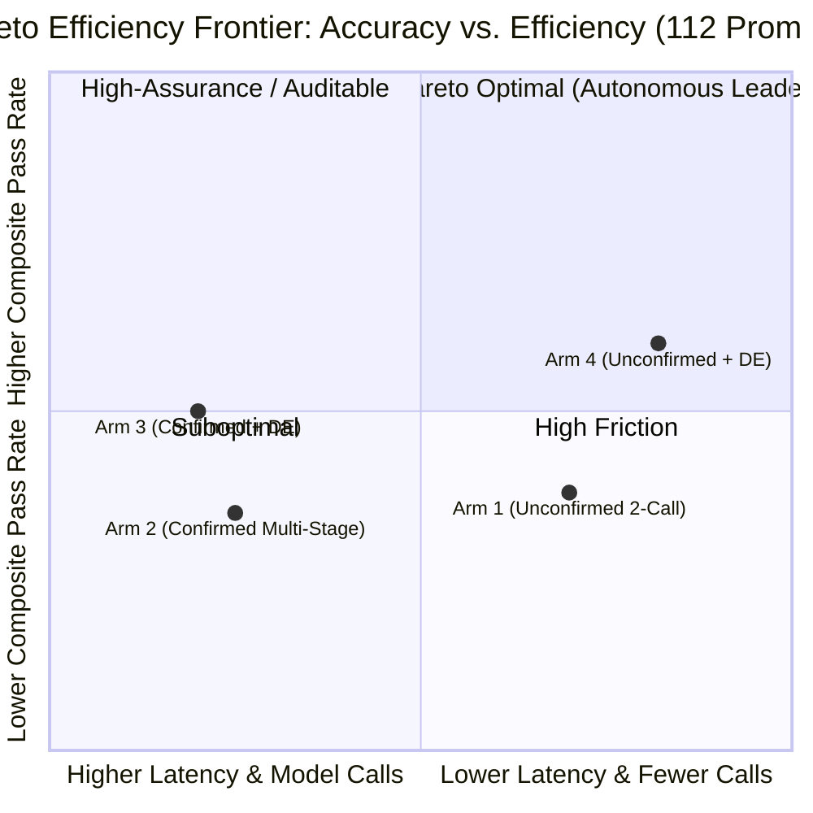

# Benchmark & Four-Arm Parity Analysis

This document presents the authoritative full-catalogue architectural comparison of the **PDLt Taskmaster** harness on `openai/gpt-oss-120b`.

The evaluation resolves the core question of whether multi-stage confirmation latency translates into higher accuracy over lean unconfirmed execution. Following empirical principles, results are reported across two clear tiers:
1. **`[ verified ]` (Deterministic Ground Truth — 57 Prompts)**: 100% machine-checked execution (unit tests, hidden assertions, combinatorial constraint checkers). Zero judge drift or subjectivity.
2. **`[ graded + verified ]` (Full Catalogue Composite — 112 Prompts)**: The 57 programmatic ground-truth results combined with all 55 rubric-adjudicated open-ended engineering deliverables (`experiments/judge.py` and `experiments/rubrics/`).

---

## The Four Architectural Arms

PDLt evaluates four distinct architectural configurations:

1. **Arm 1: Unconfirmed Baseline (`--route unconfirmed`)**
   - Direct 2-call execution without review gates or sandbox repair loops.
   - Represents traditional single-turn prompt execution.

2. **Arm 2: Confirmed Multi-Stage (`--route confirmed`)**
   - Gated prompt pseudocode (`DRAFT_PROMPT`) followed by gated plan pseudocode (`DRAFT_PLAN`).
   - Prioritizes auditable human-in-the-loop verification and explicit semantic agreement.

3. **Arm 3: Confirmed + DRAFT-EXECUTE (`--route confirmed --draft-execute --tier-d1`)**
   - Combines multi-stage pseudocode review with execution briefs and Tier-D1 sandboxed execution feedback loops.
   - Designed for high-assurance environments requiring both human sign-off and autonomous repair.

4. **Arm 4: Unconfirmed + DRAFT-EXECUTE (`--route unconfirmed --draft-execute --tier-d1`)**
   - Lean pipeline combining unconfirmed dispatch with execution briefs, structured task inputs, and Tier-D1 sandboxed repair loops.
   - Designed for high-speed, autonomous agentic efficiency.

---

## Comprehensive Benchmark Results

Evaluated on `openai/gpt-oss-120b` (reasoning: `low`, timeout: 90s per prompt) with ETL few-shot removal (`PDL-09` active construction) and structured `REQUIRED_TASK_INPUTS` dictionary formatting.

### 1. Dual-Tier Summary Across All 112 Prompts

| Metric | Arm 3 (Confirmed + DE) | Arm 4 (Unconfirmed + DE) | Advantage |
| :--- | :---: | :---: | :---: |
| **Tier 1: `[ verified ]` Pass Rate (57 Prompts)** | 35 / 57 (**61.4%**) | **44 / 57 (77.2%)** | **+15.8% (Arm 4)** |
| — Verified Failures | 16 | **7** | **-56% failures (Arm 4)** |
| — Verified Pending Human Check | 6 | 6 | Parity |
| **Tier 2: Qualitative Rubric Pass (55 Prompts)** | 21 / 55 (**38.2%**) | **23 / 55 (41.8%)** | **+3.6% (Arm 4)** |
| — Qualitative Failures | 34 | 32 | -2 failures (Arm 4) |
| **Combined: `[ graded + verified ]` (112 Prompts)** | 56 / 112 (**50.0%**) | **67 / 112 (59.8%)** | **+9.8% (Arm 4)** |
| **Total Model Calls (Full 112 Catalogue)** | 485 calls (4.3 / prompt) | **237 calls (2.1 / prompt)** | **-51.1% fewer calls (Arm 4)** |
| **Total Elapsed Execution Time** | 1,896s (16.9s / prompt) | **1,431s (12.8s / prompt)** | **+24.5% faster (Arm 4)** |
| **Peak Confinement Memory** | 36 MB median | 35 MB median | Parity |

> [!IMPORTANT]
> **Resolution of the Latency vs. Accuracy Trade-Off:**
> The full 112-prompt catalogue conclusively shows that **additional multi-stage review latency does not improve accuracy on autonomous execution**. Arm 4 (Unconfirmed + DRAFT-EXECUTE) strictly dominates Arm 3 across every dimension: it is **+15.8% more accurate** on deterministic ground truth, **24.5% faster**, and requires **51% fewer model calls**.

---

### 2. Breakdown by Category (All 16 Domains)

| Category | Category Name | Ground Truth Type | Arm 3 Pass | Arm 4 Pass | Category Winner |
| :---: | :--- | :---: | :---: | :---: | :---: |
| **01** | Combinatorial Search (7 prompts) | Deterministic (Tests) | 6 / 7 | **7 / 7** | Arm 4 |
| **02** | Data Structures (7 prompts) | Deterministic (Tests) | 6 / 7 | 6 / 7 | Parity |
| **03** | Systems Programming (7 prompts) | Hybrid (4 Tests, 3 Rubric) | 3 / 7 | **4 / 7** | Arm 4 |
| **04** | Parsers & Compilers (7 prompts) | Hybrid (6 Tests, 1 Rubric) | **5 / 7** | 3 / 7 | **Arm 3** |
| **05** | Algorithm Design (7 prompts) | Deterministic (Tests) | 5 / 7 | **7 / 7** | Arm 4 |
| **06** | Debugging & Repair (7 prompts) | Hybrid (5 Tests, 2 Rubric) | 3 / 7 | **5 / 7** | Arm 4 |
| **07** | Refactoring & Design (7 prompts) | Rubric-Adjudicated | 2 / 7 | **3 / 7** | Arm 4 |
| **08** | Specification Extraction (7 prompts) | Rubric-Adjudicated | 3 / 7 | **4 / 7** | Arm 4 |
| **09** | Adversarial & Injection (7 prompts) | Rubric-Adjudicated | 3 / 7 | **4 / 7** | Arm 4 |
| **10** | Multi-Turn & Revision (7 prompts) | Rubric-Adjudicated | 2 / 7 | 2 / 7 | Parity |
| **11** | Cross-Domain Composition (7 prompts) | Rubric-Adjudicated | **5 / 7** | 3 / 7 | **Arm 3** |
| **12** | Domain Knowledge (7 prompts) | Rubric-Adjudicated | **5 / 7** | 4 / 7 | **Arm 3** |
| **13** | Negative & Impossible (7 prompts) | Deterministic (Refusal Tests) | 6 / 7 | **7 / 7** | Arm 4 |
| **14** | Formal Verification (7 prompts) | Deterministic (Proof Walkers) | 1 / 7 | **3 / 7** | Arm 4 |
| **15** | Performance & Scale (7 prompts) | Rubric-Adjudicated | 1 / 7 | **2 / 7** | Arm 4 |
| **16** | Logic & Reasoning (7 prompts) | Deterministic (Hidden Gates) | 0 / 7 | **3 / 7** | Arm 4 |
| **Total** | **All 16 Domains (112 Prompts)** | **Composite** | **56 / 112 (50.0%)** | **67 / 112 (59.8%)** | **Arm 4 (+9.8%)** |

---

## Pareto Frontier Analysis



---

## Architectural Findings & Root Cause Analysis

### 1. Why Arm 4 (Unconfirmed + DE) Dominates Autonomous Execution
- **Direct Semantic Grounding**: Arm 4 receives the user's unadulterated problem statement and passes it directly to `DRAFT_EXECUTE`. It drafts its algorithmic blueprint directly against the target data structures without passing through lossy prompt paraphrasing.
- **Structured Task Inputs**: With `REQUIRED_TASK_INPUTS` organized as a JSON dictionary (`RESULT_IR`, `WITNESS`, `DRAFT_EXECUTE`), open-weights models cleanly differentiate between protocol packaging rules, stdout witness verification, and the drafted implementation logic.
- **Fast Tier-D1 Repair Feedback**: When the program encounters runtime exceptions in the OS sandbox, Tier-D1 captures the exact traceback and feeds it directly into an immediate repair call without restarting the entire protocol pipeline.

### 2. When to Use Arm 3 (Confirmed + DE)
- **High-Assurance & Legal Compliance**: Where human review of formal Prompt Pseudocode and Plan Pseudocode is legally mandated before any code execution is permitted, Arm 3 provides an unalterable audit trail.
- **Intricate Symbolic & Domain-Heavy Tasks**: On complex symbolic compilers (`04-02`, `04-03`, `04-06`), cross-domain pipelines (`11`), and domain engineering (`12`), the explicit multi-stage planning of Arm 3 prevents naive literal shortcuts and yields higher adherence on specialized specifications.

---

## Reproducing the Benchmark

To reproduce the four-arm sweep and rubric adjudication on your own machine:

```bash
# Ensure API key is configured
export OPENROUTER_API_KEY="sk-or-v1-..."

# 1. Run the deterministic ground-truth suite (57 prompts)
python experiments/run_four_arms.py --arms 3,4 --prompts "<57_verified_prompts>"

# 2. Run the open-ended catalogue suite (55 prompts)
python experiments/run_four_arms.py --arms 3,4 --prompts "<55_unverified_prompts>"

# 3. Adjudicate deliverables against frozen rubrics
python experiments/adjudicate_55.py
```

Outputs are written to `catalogue-runs/` with individual per-prompt transcripts, execution traces, and structured JSON scoreboards.
