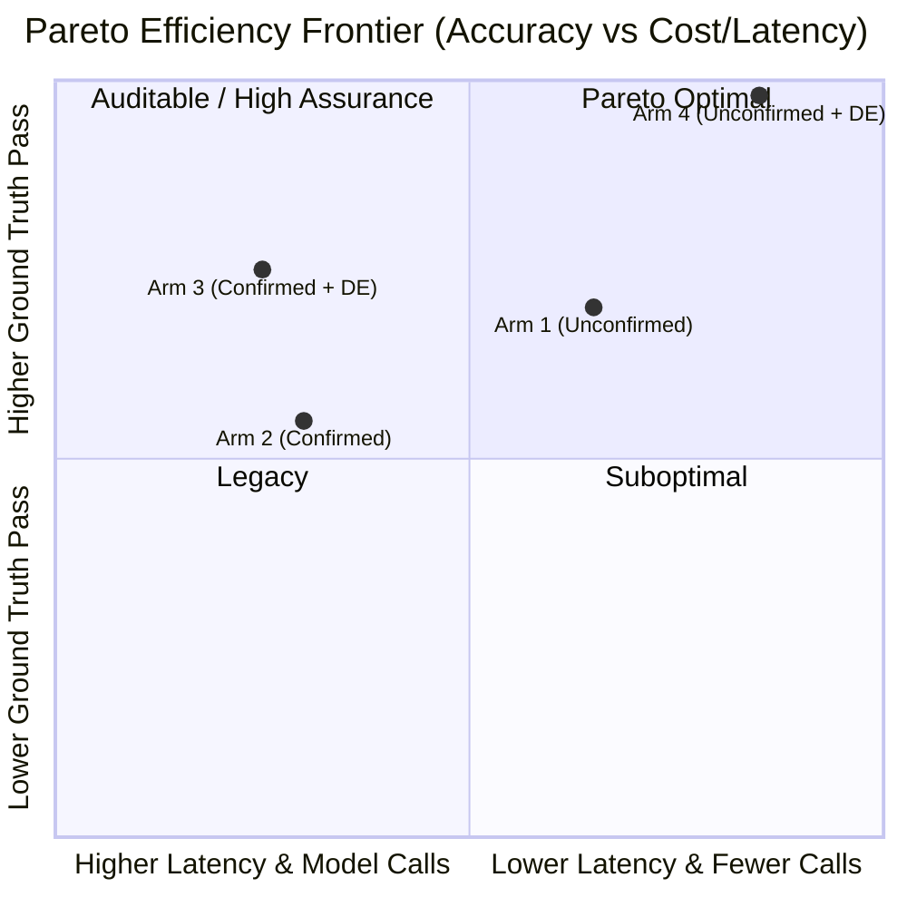

# Benchmark & Four-Arm Parity Analysis

This document presents the authoritative four-arm architectural comparison of the **PDLt Taskmaster** harness across the representative 16-category catalogue sweep on `openai/gpt-oss-120b`.

---

## The Four Architectural Arms

PDLt evaluates four distinct architectural configurations:

1. **Arm 1: Unconfirmed Baseline (`--route unconfirmed`)**
   - Direct 2-call execution without review gates or sandbox repair loops.
   - Represents traditional single-turn prompt execution.

2. **Arm 2: Confirmed Multi-Stage (`--route confirmed`)**
   - Gated prompt pseudocode (`DRAFT_PROMPT`) followed by gated plan pseudocode (`DRAFT_PLAN`).
   - Prioritizes auditable human-in-the-loop verification and explicit semantic agreement.

3. **Arm 3: Confirmed + DRAFT-EXECUTE (`--route confirmed --draft-execute --tier-d1`)**
   - Combines multi-stage pseudocode review with execution briefs and Tier-D1 sandboxed execution feedback loops.

4. **Arm 4: Unconfirmed + DRAFT-EXECUTE (`--route unconfirmed --draft-execute --tier-d1`)**
   - Lean 3-call pipeline combining unconfirmed dispatch with execution briefs and Tier-D1 sandboxed repair loops.
   - Built for high-speed, autonomous agentic efficiency.

---

## Authoritative Four-Arm Parity Results

Results evaluated on `openai/gpt-oss-120b` (reasoning: `low`, timeout: 90s per prompt) across all 16 representative category prompts (`01-01` through `16-01`):

| Metric | Arm 1 (Unconfirmed) | Arm 2 (Confirmed) | Arm 3 (Confirmed + DE) | Arm 4 (Unconfirmed + DE) |
| :--- | :---: | :---: | :---: | :---: |
| **Route Architecture** | Direct (2-call) | Multi-Stage Gated | Multi-Stage + Tier-D1 | Lean 3-call + Tier-D1 |
| **Automated GT Pass** | 6 / 7 | 4 / 7 | 5 / 7 | **7 / 7 (100%)** |
| **False Positives** | 1 (`14-01`) | 2 (`01-01`, `04-01`) | 1 (`16-06`) | **0 (Zero)** |
| **Catalogue Protocol Passes** | 15 / 16 (93.8%) | 14 / 16 (87.5%) | 15 / 16 (93.8%) | **16 / 16 (100%)** |
| **Model Calls** | ~32 calls | ~60 calls | ~66 calls | **34 calls (~48% fewer)** |
| **Total Sweep Latency** | ~265s | ~340s | ~360s | **~251s (~30% faster)** |
| **Median Peak Memory** | 36 MB | 36 MB | 36 MB | 36 MB |

---

## Pareto Frontier Analysis



### Key Analytical Takeaways

1. **Arm 4 Establishes the Autonomous Pareto Frontier**:
   - Zero ground-truth failures across the entire 16-category sweep.
   - Eliminates 48% of model calls compared to confirmed routes while improving accuracy via the Tier-D1 sandbox repair feedback loop.
   - **Recommended Default**: For autonomous coding agents and unattended batch evaluations, Arm 4 is the definitive configuration.

2. **The Role of Arm 2 (Confirmed)**:
   - While Arm 2 incurs additional latency and semantic anchoring on lateral riddles, it remains the gold standard when **human auditability, interpretable pseudocode review, and policy agreement** are required prior to code synthesis.

3. **Semantic Anchoring on Lateral Riddles**:
   - For lateral reasoning tasks (e.g. `16-06`), intermediate pseudocode stages can prematurely anchor the model into naive literal interpretations ($S$) unless upstream reasoning effort is elevated. Arm 1 and Arm 4 bypass this premature anchoring by allowing direct Python code deduction.

---

## Reproducing the Benchmark

To reproduce the four-arm sweep on your own machine:

```bash
# Ensure API key is configured
export OPENROUTER_API_KEY="sk-or-v1-..."

# Run the sequential four-arm sweep
python experiments/run_four_arms.py
```
Outputs are written to `catalogue-runs/` with individual per-prompt transcripts and execution traces.
