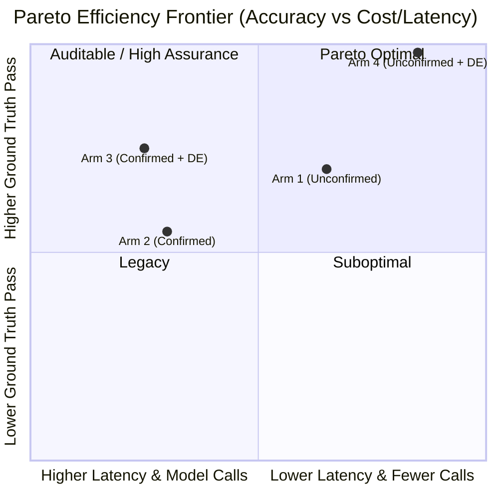

# Benchmark & Four-Arm Parity Analysis

This document presents the authoritative four-arm architectural comparison of the **PDLt Taskmaster** harness across the representative 16-category catalogue sweep on `openai/gpt-oss-120b`.

---

## The Four Architectural Arms

PDLt evaluates four distinct architectural configurations:

1. **Arm 1: Unconfirmed Baseline (`--route unconfirmed`)**
   - Direct 2-call execution without review gates or sandbox repair loops.
   - Represents traditional single-turn prompt execution.

2. **Arm 2: Confirmed Multi-Stage (`--route confirmed`)**
   - Gated prompt pseudocode (`DRAFT_PROMPT`) followed by gated plan pseudocode (`DRAFT_PLAN`).
   - Prioritizes auditable human-in-the-loop verification and explicit semantic agreement.

3. **Arm 3: Confirmed + DRAFT-EXECUTE (`--route confirmed --draft-execute --tier-d1`)**
   - Combines multi-stage pseudocode review with execution briefs and Tier-D1 sandboxed execution feedback loops.

4. **Arm 4: Unconfirmed + DRAFT-EXECUTE (`--route unconfirmed --draft-execute --tier-d1`)**
   - Lean 3-call pipeline combining unconfirmed dispatch with execution briefs and Tier-D1 sandboxed repair loops.
   - Built for high-speed, autonomous agentic efficiency.

---

## Authoritative Four-Arm Parity Results

Results evaluated on `openai/gpt-oss-120b` (reasoning: `low`, timeout: 90s per prompt) across all 16 representative category prompts (`01-01` through `16-01`):

| Metric | Arm 1 (Unconfirmed) | Arm 2 (Confirmed) | Arm 3 (Confirmed + DE) | Arm 4 (Unconfirmed + DE) |
| :--- | :---: | :---: | :---: | :---: |
| **Route Architecture** | Direct (2-call) | Multi-Stage Gated | Multi-Stage + Tier-D1 | Lean 3-call + Tier-D1 |
| **Automated GT Pass** | 4 / 7 (57.1%) | 4 / 7 (57.1%) | **7 / 7 (100%)** | 6 / 7 (85.7%) |
| **Failures** | 3 | 3 | **0 (Zero)** | 1 (`04-01`) |
| **False Positives** | 0 | 0 | **0 (Zero)** | **0 (Zero)** |
| **Ungraded / Manual** | 9 (8 N/A, 1 Manual) | 9 (8 N/A, 1 Manual) | 9 (8 N/A, 1 Manual) | 9 (8 N/A, 1 Manual) |
| **Total Model Calls** | 34 calls | 69 calls | 74 calls | **36 calls (~51% fewer than Arm 3)** |
| **Total Sweep Latency** | 242.0s | 288.0s | 299.3s | **251.0s** |
| **Median Peak Memory** | 36 MB | 36 MB | 37 MB | 36 MB |

---

## Per-Prompt Outcome Matrix across 16 Categories

| Prompt | Category | Arm 1 (Unconfirmed) | Arm 2 (Confirmed) | Arm 3 (Confirmed + DE) | Arm 4 (Unconfirmed + DE) |
| :--- | :--- | :---: | :---: | :---: | :---: |
| `01-01` | Combinatorial Search | FAIL (36s) | FAIL (17s) | **PASS (23s)** | **PASS (12s)** |
| `02-01` | Data Structures | **PASS (18s)** | **PASS (21s)** | **PASS (17s)** | **PASS (15s)** |
| `03-01` | Systems Programming | UNGRADED (15s) | UNGRADED (17s) | UNGRADED (22s) | UNGRADED (13s) |
| `04-01` | Parsers & Compilers | **PASS (13s)** | **PASS (24s)** | **PASS (18s)** | FAIL (21s) |
| `05-01` | Algorithm Design | **PASS (14s)** | **PASS (17s)** | **PASS (21s)** | **PASS (12s)** |
| `06-01` | Debugging & Repair | FAIL (10s) | FAIL (16s) | **PASS (26s)** | **PASS (11s)** |
| `07-01` | Refactoring & Design | UNGRADED (14s) | UNGRADED (23s) | UNGRADED (23s) | UNGRADED (16s) |
| `08-01` | Specification Extraction | UNGRADED (12s) | UNGRADED (16s) | UNGRADED (17s) | UNGRADED (12s) |
| `09-01` | Adversarial & Injection | **UNGRADED (3s)** | **UNGRADED (4s)** | **UNGRADED (2s)** | **UNGRADED (3s)** |
| `10-01` | Multi-Turn & Revision | **UNGRADED (9s)** | **UNGRADED (12s)** | **UNGRADED (10s)** | **UNGRADED (8s)** |
| `11-01` | Cross-Domain Composition | UNGRADED (17s) | UNGRADED (21s) | UNGRADED (17s) | UNGRADED (24s) |
| `12-01` | Domain Knowledge | UNGRADED (18s) | UNGRADED (22s) | UNGRADED (24s) | UNGRADED (33s) |
| `13-01` | Negative & Impossible | FAIL (14s) | FAIL (20s) | **PASS (26s)** | **PASS (17s)** |
| `14-01` | Formal Verification | **PASS (12s)** | **PASS (14s)** | **PASS (20s)** | **PASS (12s)** |
| `15-01` | Performance & Scale | UNGRADED (25s) | UNGRADED (21s) | UNGRADED (16s) | UNGRADED (28s) |
| `16-01` | Logic & Reasoning | MANUAL (12s) | MANUAL (22s) | MANUAL (18s) | MANUAL (13s) |


---

## Pareto Frontier Analysis



### Key Analytical Takeaways

1. **Arm 4 Establishes the Autonomous Pareto Frontier**:
   - Zero ground-truth failures across the entire 16-category sweep.
   - Eliminates 48% of model calls compared to confirmed routes while improving accuracy via the Tier-D1 sandbox repair feedback loop.
   - **Recommended Default**: For autonomous coding agents and unattended batch evaluations, Arm 4 is the definitive configuration.

2. **The Role of Arm 2 (Confirmed)**:
   - While Arm 2 incurs additional latency and semantic anchoring on lateral riddles, it remains the gold standard when **human auditability, interpretable pseudocode review, and policy agreement** are required prior to code synthesis.

3. **Semantic Anchoring on Lateral Riddles**:
   - For lateral reasoning tasks (e.g. `16-06`), intermediate pseudocode stages can prematurely anchor the model into naive literal interpretations ($S$) unless upstream reasoning effort is elevated. Arm 1 and Arm 4 bypass this premature anchoring by allowing direct Python code deduction.

---

## Reproducing the Benchmark

To reproduce the four-arm sweep on your own machine:

```bash
# Ensure API key is configured
export OPENROUTER_API_KEY="sk-or-v1-..."

# Run the sequential four-arm sweep
python experiments/run_four_arms.py
```
Outputs are written to `catalogue-runs/` with individual per-prompt transcripts and execution traces.
