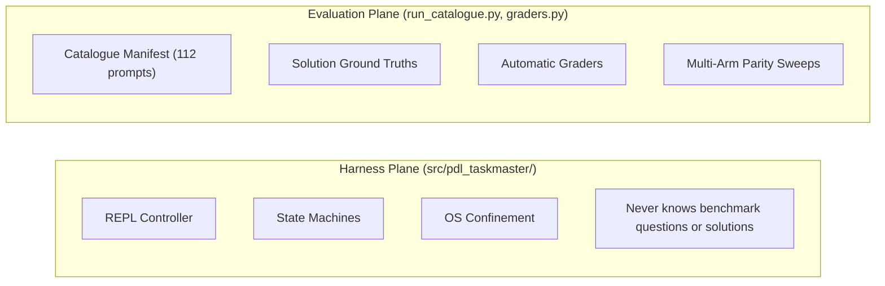

# PDLt Taskmaster & The System 2 Catalogue

**PDLt Taskmaster** is a controller-gated REPL harness and evaluation platform designed for verified, auditable agentic execution.

---

## Core Premise: Controller-Gated Agentic Execution

Most agentic harnesses give large language models uncontrolled execution loops: the model generates code, runs arbitrary shell commands, and loops recursively without deterministic checkpoints or structured semantic bounds.

PDLt fundamentally shifts the paradigm:
1. **Semantic Bootstrap Containment**: Raw user text and untrusted prompt data remain passive data. The model cannot execute until interpretation and planning phases are complete.
2. **Controller-Gated Phases**: The model interprets user requests as short, human-readable pseudocode and waits for confirmation before execution begins.
3. **OS-Native Confinement**: All generated code executes inside a restricted, session-scoped OS sandbox (Landlock on Linux, Seatbelt on macOS, AppContainers on Windows).
4. **Deterministic Delivery Verification**: Code and results are checked against formal output contracts, verification suites, and witness projections.

---

## The Two-Plane Separation

A foundational design invariant in PDLt is the strict separation between the execution harness and the evaluation benchmark:

| Plane | Location | Benchmark Knowledge | Enforced By |
| :--- | :--- | :--- | :--- |
| **Harness** | `src/pdl_taskmaster/` | **Zero** (cannot contain hints, regexes, or solutions) | `tests/test_harness_anti_overfitting.py` |
| **Evaluation** | `run_catalogue.py`, `graders.py` | Full access to ground truth solutions | Manifest integrity & automated grading |

The harness acts strictly as a referee, never a solver: no algorithm hints, no keyword gates, and no fabricated witnesses. A failed prompt is diagnostic data; a gamed pass is an integrity defect.
